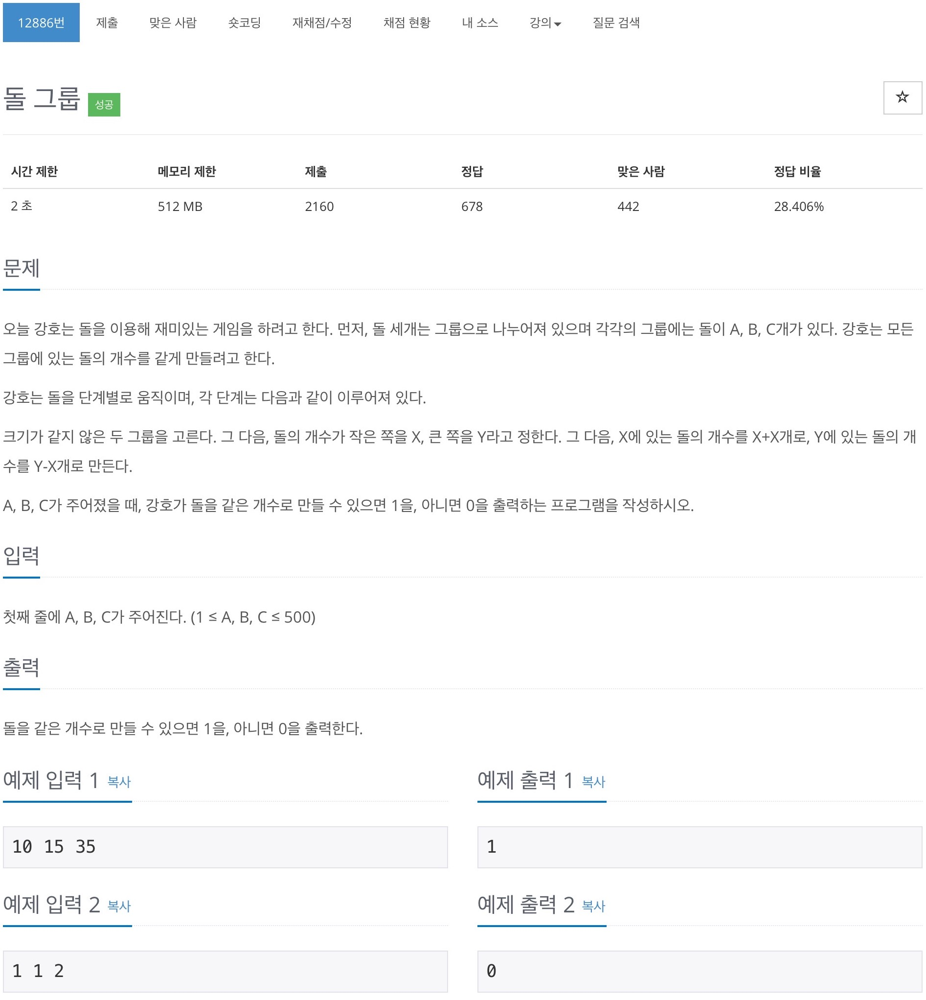

# 백준 12886 - 돌 그룹



## 채점 현황


## 전체 소스 코드
```cpp
#include <iostream>
#include <queue>
#include <set>
using namespace std;

int a, b, c;
set<pair<pair<int, int>, int>> check;

int main(void) {
    cin >> a >> b >> c;

    queue<pair<pair<int, int>, int>> q;
    q.push({{a, b}, c});
    check.insert({{a, b}, c});

    while (!q.empty()) {
        int cntA = q.front().first.first;
        int cntB = q.front().first.second;
        int cntC = q.front().second;
        q.pop();

        if (cntA == cntB && cntB == cntC) {
            cout << 1 << '\n';
            return 0;
        }

        if (cntA != cntB) {
            int nextA, nextB;
            if (cntA > cntB) {
                nextA = cntA - cntB;
                nextB = cntB + cntB;

            } else {
                nextA = cntA + cntA;
                nextB = cntB - cntA;
            }
            if (check.find({{nextA, nextB}, cntC}) == check.end()) {
                check.insert({{nextA, nextB}, cntC});
                q.push({{nextA, nextB}, cntC});
            }
        }
        if (cntA != cntC) {
            int nextA, nextC;
            if (cntA > cntC) {
                nextA = cntA - cntC;
                nextC = cntC + cntC;
            } else {
                nextA = cntA + cntA;
                nextC = cntC - cntA;
            }

            if (check.find({{nextA, cntB}, nextC}) == check.end()) {
                check.insert({{nextA, cntB}, nextC});
                q.push({{nextA, cntB}, nextC});
            }
        }
        if (cntB != cntC) {
            int nextB, nextC;
            if (cntB > cntC) {
                nextB = cntB - cntC;
                nextC = cntC + cntC;
            } else {
                nextB = cntB + cntB;
                nextC = cntC - cntB;
            }

            if (check.find({{cntA, nextB}, nextC}) == check.end()) {
                check.insert({{cntA, nextB}, nextC});
                q.push({{cntA, nextB}, nextC});
            }
        }
    }

    cout << 0 << endl;
    return 0;
}
```