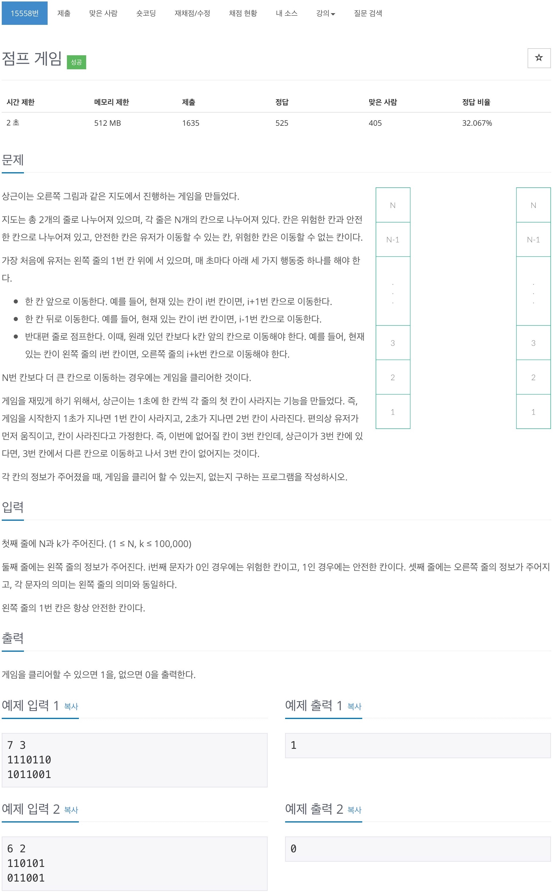
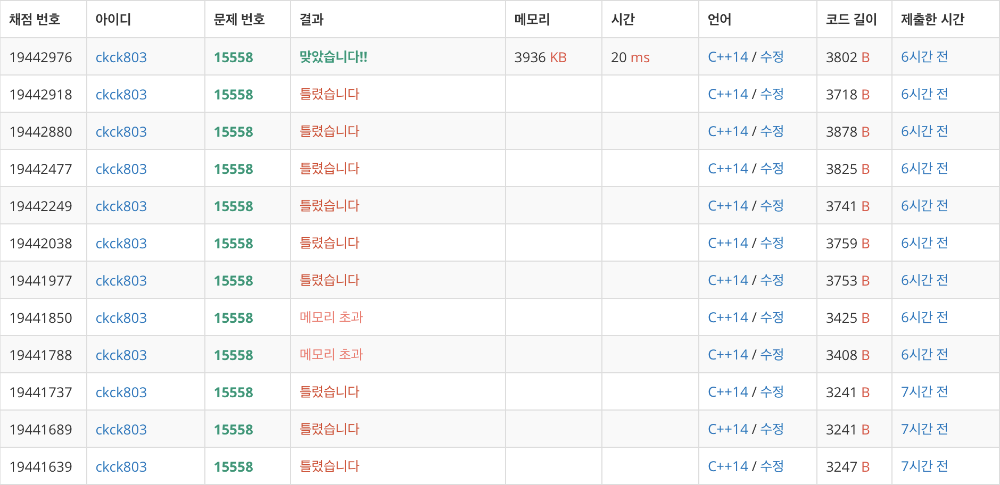

# 백준 15558 - 점프 게임



## 채점 현상



## 전체 소스 코드
```cpp
#include <bits/stdc++.h>
using namespace std;

int N, K;
// 0은 왼쪽, 1은 오른쪽;
int Map[2][200020];
bool visited[2][200020];

struct point {
    int cnt;
    // 0 = 왼쪽, 1 = 오른쪽
    int state;
};

int main(void) {
    scanf("%d %d", &N, &K);

    for (int k = 0; k < 2; k++) {
        for (int i = 1; i <= N; i++) {
            scanf("%1d", &Map[k][i]);
        }
    }

    queue<point> q;
    q.push({1, 0});
    visited[1][0] = true;
    int remove_point = 1;

    while (!q.empty()) {
        int q_size = q.size();

        while (q_size--) {
            int index = q.front().cnt;
            bool state = q.front().state;
            q.pop();

            if (index > N) {
                printf("1\n");
                return 0;
            }

            if (Map[state][index] == -1) {
                continue;
            }

            // 앞으로 움직인다.
            int move_front = index + 1;
            if (move_front > N || (Map[state][move_front] == 1 && visited[state][move_front] == false)) {
                visited[state][move_front] = true;
                q.push({move_front, state});
            }

            // 뒤로 움직인다.
            int move_back = index - 1;
            if (move_back > N || (Map[state][move_back] == 1 && visited[state][move_back] == false)) {
                visited[state][move_back] = true;
                q.push({move_back, state});
            }

            // 다른쪽 지도로 움직인다.
            int move_other = index + K;
            if (move_other > N || (Map[1 ^ state][move_other] == 1 && visited[1 ^ state][move_other] == false)) {
                visited[1 ^ state][move_other] = true;
                q.push({move_other, 1 ^ state});
            }
        }

        for (int i = 0; i < 2; i++) {
            Map[i][remove_point] = -1;
        }
        remove_point++;
    }
    printf("%d\n", 0);
    return 0;
}
```