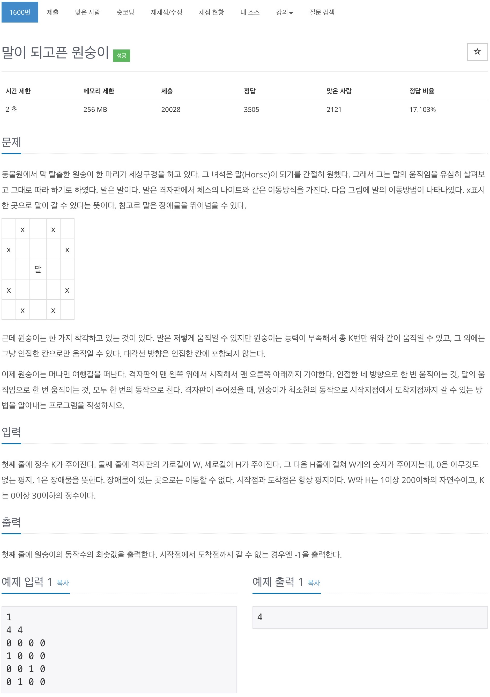

# 백준 1600 - 말이 되고픈 원숭이


## 체점 현황


## 전체 소스 코드
```cpp
#include <iostream>
#include <queue>
using namespace std;

int K, W, H;
int map[220][220];
bool check[220][220][31];
int dx[4] = { 1, -1, 0, 0 };
int dy[4] = { 0, 0, 1, -1 };

int hx[8] = { 1, 2, 2, 1, -1, -2, -2, -1 };
int hy[8] = { -2, -1, 1, 2, 2, 1, -1, -2 };

struct point {
    int y;
    int x;
    int k;
    int num;
};

int main(void)
{
    cin >> K >> W >> H;

    for (int i = 0; i < H; i++) {
        for (int j = 0; j < W; j++) {
            cin >> map[i][j];
        }
    }

    queue<point> q;
    q.push({ 0, 0, K, 0 });
    check[0][0][K] = true;
    bool isPass = true;
    int minValue = 100000000;

    while (!q.empty()) {
        int y = q.front().y;
        int x = q.front().x;
        int k = q.front().k;
        int moveNum = q.front().num;
        q.pop();

        if (y == (H - 1) && x == (W - 1)) {
            if (minValue > moveNum) {
                minValue = moveNum;
            }
            isPass = false;
        }

        if (k > 0) {
            for (int i = 0; i < 8; i++) {
                int ny = y + hy[i];
                int nx = x + hx[i];

                if (0 <= ny && ny < H && 0 <= nx && nx < W) {
                    if (check[ny][nx][k - 1] == false && map[ny][nx] != 1) {
                        check[ny][nx][k - 1] = true;
                        q.push({ ny, nx, k - 1, moveNum + 1 });
                    }
                }
            }
        }

        for (int i = 0; i < 4; i++) {
            int ny = y + dy[i];
            int nx = x + dx[i];

            if (0 <= ny && ny < H && 0 <= nx && nx < W) {
                if (check[ny][nx][k] == false && map[ny][nx] != 1) {
                    check[ny][nx][k] = true;
                    q.push({ ny, nx, k, moveNum + 1 });
                }
            }
        }
    }

    if (isPass) {
        cout << -1 << '\n';
    } else {
        cout << minValue << '\n';
    }
    return 0;
}
```