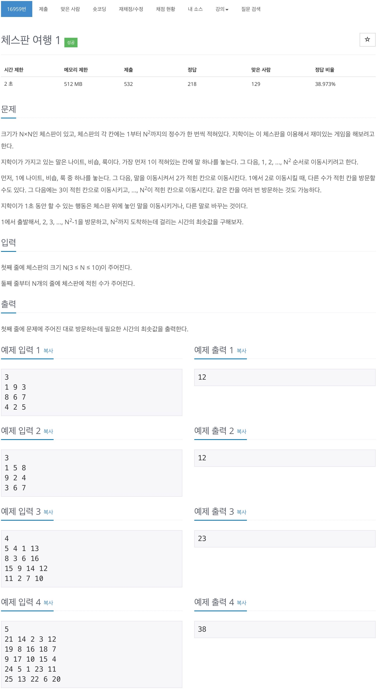
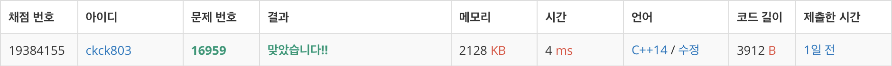

# 백준 16959 - 체스판 여행 1



## 채점 현황



## 전체 소스 코드
```cpp
#include <bits/stdc++.h>
using namespace std;

#define KNGITH 0
#define BISHOP 1
#define ROOK 2

int n;
int board[11][11];
int knight_dx[8] = {2, 2, -2, -2, 1, 1, -1, -1};
int knight_dy[8] = {1, -1, 1, -1, 2, -2, 2, -2};
int bishop_dx[4] = {1, 1, -1, -1};
int bishop_dy[4] = {1, -1, 1, -1};
int rook_dx[4] = {1, -1, 0, 0};
int rook_dy[4] = {0, 0, 1, -1};
int check[3][101][11][11];

struct point {
    int y;
    int x;
    int count;
    int cnt;
    int state;
};

queue<point> q;

int bfs() {
    while (!q.empty()) {
        int cntY = q.front().y;
        int cntX = q.front().x;
        int count = q.front().count;
        int cnt = q.front().cnt;
        int state = q.front().state;
        q.pop();

        int next = cnt + 1;

        if (cnt == n * n) {
            return count;
        }

        for (int i = 0; i < 3; i++) {
            if (state == i) {
                continue;
            }

            if (check[i][cnt][cntY][cntX]) {
                continue;
            }

            q.push({cntY, cntX, count + 1, cnt, i});
        }

        if (state == KNGITH) {
            for (int i = 0; i < 8; i++) {
                int ny = cntY + knight_dy[i];
                int nx = cntX + knight_dx[i];

                if (0 > ny || ny >= n || 0 > nx || nx >= n) {
                    continue;
                }

                if (check[KNGITH][cnt][ny][nx]) {
                    continue;
                }

                if (board[ny][nx] == next) {
                    check[KNGITH][next][ny][nx] = true;
                    q.push({ny, nx, count + 1, next, KNGITH});
                } else {
                    check[KNGITH][cnt][ny][nx] = true;
                    q.push({ny, nx, count + 1, cnt, KNGITH});
                }
            }
        }

        if (state == BISHOP) {
            for (int i = 0; i < 4; i++) {
                int k = 0;
                while (++k) {
                    int ny = cntY + bishop_dy[i] * k;
                    int nx = cntX + bishop_dx[i] * k;

                    if (0 > ny || ny >= n || 0 > nx || nx >= n) {
                        break;
                    }

                    if (check[BISHOP][cnt][ny][nx]) {
                        continue;
                    }

                    if (board[ny][nx] == next) {
                        check[BISHOP][next][ny][nx] = true;
                        q.push({ny, nx, count + 1, next, BISHOP});
                    } else {
                        check[BISHOP][cnt][ny][nx] = true;
                        q.push({ny, nx, count + 1, cnt, BISHOP});
                    }
                }
            }
        }

        if (state == ROOK) {
            for (int i = 0; i < 4; i++) {
                int k = 0;
                while (++k) {
                    int ny = cntY + rook_dy[i] * k;
                    int nx = cntX + rook_dx[i] * k;

                    if (0 > ny || ny >= n || 0 > nx || nx >= n) {
                        break;
                    }

                    if (check[ROOK][cnt][ny][nx]) {
                        continue;
                    }

                    if (board[ny][nx] == next) {
                        check[ROOK][next][ny][nx] = true;
                        q.push({ny, nx, count + 1, next, ROOK});
                    } else {
                        check[ROOK][cnt][ny][nx] = true;
                        q.push({ny, nx, count + 1, cnt, ROOK});
                    }
                }
            }
        }
    }
}

int main(void) {
    cin >> n;

    for (int i = 0; i < n; i++) {
        for (int j = 0; j < n; j++) {
            cin >> board[i][j];

            if (board[i][j] == 1) {
                for (int k = 0; k < 3; k++) {
                    q.push({i, j, 0, 1, k});
                    check[k][1][i][j] = true;
                }
            }
        }
    }

    cout << bfs() << endl;

    return 0;
}
```
