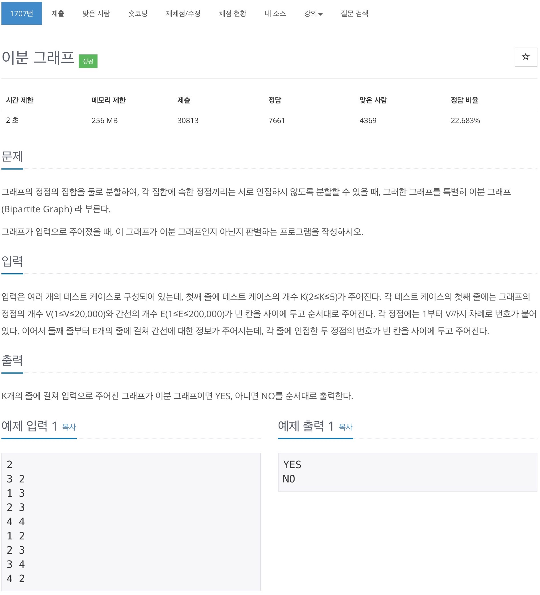
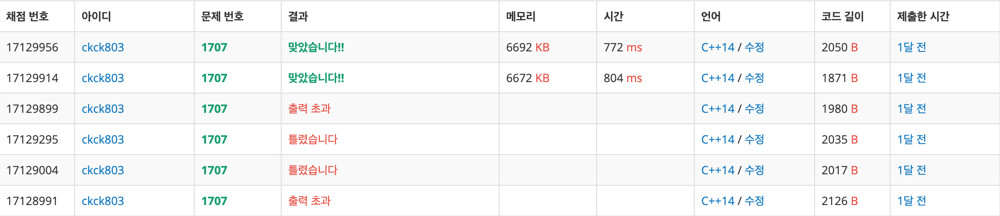

# 1707 이분 그래프



## 채점 현황



## 전체 소스 코드
```cpp
#include <iostream>
#include <vector>
using namespace std;

int T, V, E;
vector<vector<int>> arr;
bool check[20002];
bool colorCheck[20002];
int color[20002];

void paintColor(int cnt, int cntColor) {
    for (int i = 0; i < arr[cnt].size(); i++) {
        int next = arr[cnt][i];
        if (check[next] == false) {
            if (cntColor == 1) {
                color[next] = 2;
                check[next] = true;
                paintColor(next, 2);
            } else {
                color[next] = 1;
                check[next] = true;
                paintColor(next, 1);
            }
        }
    }
}

bool confirmColor(int cnt) {
    bool isTrue = true;

    for (int i = 0; i < arr[cnt].size(); i++) {
        int next = arr[cnt][i];

        if (color[cnt] != color[next]) {
            if (colorCheck[next] == false) {
                colorCheck[next] = true;
                isTrue = confirmColor(next);
            }
        } else {
            return false;
        }
    }

    return isTrue;
}

int main(void) {
    cin >> T;

    while (T--) {
        cin >> V >> E;
        arr = vector<vector<int>>(V + 1);

        for (int i = 0; i < E; i++) {
            int x, y;
            cin >> x >> y;

            arr[x].push_back(y);
            arr[y].push_back(x);
        }

        for (int i = 1; i <= V; i++) {
            if (check[i] == false) {
                check[i] = true;
                color[i] = 1;
                paintColor(i, 1);
            }
        }

        bool isTrue;
        for (int i = 1; i <= V; i++) {
            if (colorCheck[i] == false) {
                colorCheck[i] = true;
                isTrue = confirmColor(i);

                if (isTrue == false) {
                    cout << "NO" << '\n';
                    break;
                }
            }
        }
        if (isTrue == true) {
            cout << "YES" << '\n';
        }

        for (int i = 1; i <= V; i++) {
            check[i] = 0;
            colorCheck[i] = false;
            color[i] = 0;
        }
    }
}
```