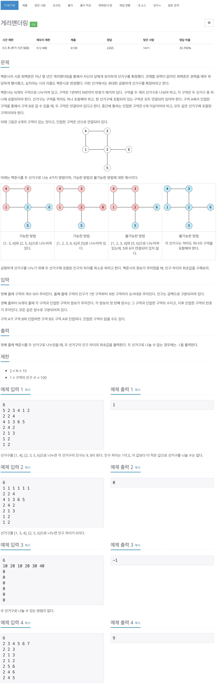
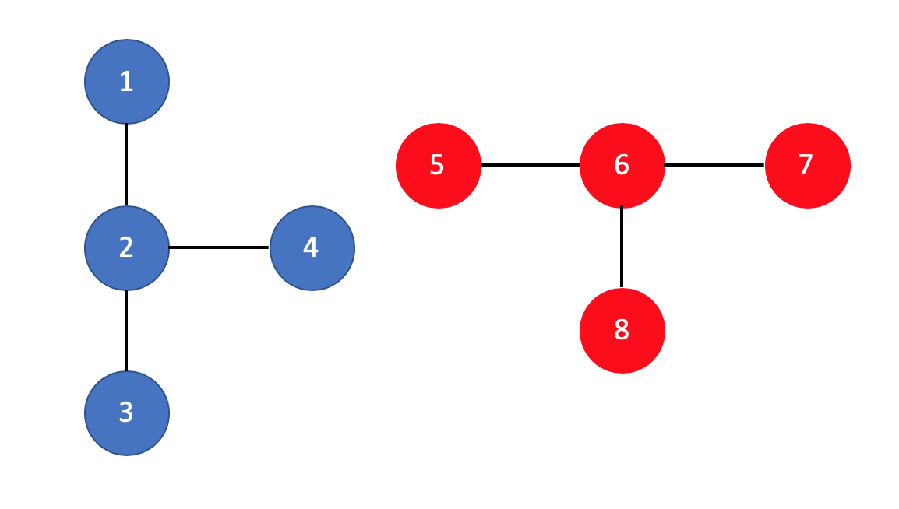

백준 17471 - 게리맨더링



## 체점 현황


## 틀린 이유
```cpp
void choose(int node, int num, int cnt) {
    if (num == cnt) {
        bfs();
        return;
    }

    for (int i = 1; i <= N; i++) {
        if (map[node][i] == 1 && point[i] == false) {
            point[i] = true;
            choose(i, num, cnt + 1);
            point[i] = false;
        }
    }
}
```
처음 그룹을 찾을때는 `백트레킹`을 이용해서 찾았고, 두번째 그룹을 찾을 경우에는 `bfs`를 이용했다. 즉, `bfs`와 `dfs`를 써서 그룹이 연결 되어 있는지 확인 했는데, 이 문제에서는 `dfs`를 이용한 경우 그룹이 연결되어 있는지 확인 못하는 경우가 존재한다.



## 문제 풀이
1. 먼저 주어진 선거구를 두 그룹으로 나누어야 한다. 몇명을 선택하는지에 대한 정보가 안나와 있으므로 `1~N/2`가지의 선택 방법이 있다.  
2. `n`개를 선택했으면 선택된 두 그룹이 서로 연결된 상태인지 확인해야 한다.
3. 만약 둘 중 하나라도 연결 되어 있지 않으면 그냥 나간다.
4. 둘 다 연결된 상태일 때는 각 그룹의 선거구 합을 구한다.
5. 선거구의 차이가 최솟값보다 작을 경우에는 값을 갱신해준다.


## 시간 복잡도 계산
1. 선거구를 선택할 수 있는 최대의 조합의 수는 `10_C_5`이다.
2. 선거구를 선택하는 갯수가 정해져 있지 않으므로 최대의 경우의 수는 `1 ~ 5` 이다.
3. 지도의 최대 크기는 10이므로 `bfs`를 이용한 최대의 경우의 수는 `10 x 10`이다.

> (10 x 100) + (45 x 100) + (120 x 100) + (210 x 100) + (252 x 100) = 63,700 즉, 최대 6만 4천번 정도의 연산을 하게 된다.

## 1 ~ N/2까지 선택하는 조합
```cpp
for (int i = 1; i <= N / 2; i++) {
    nCr(i, 0);
}
```

## r개를 선택하는 조합 
```cpp
void nCr(int r, int num) {
    if (r == num) {
        vector<int> group1;
        vector<int> group2;
        for (int i = 1; i <= N; i++) {
            if (check[i] == true) {
                group1.push_back(i);
            } else {
                group2.push_back(i);
            }
        }

        bool isConnected1, isConnected2;
        isConnected1 = bfs(group1);
        isConnected2 = bfs(group2);

        if (!isConnected1 || !isConnected2) {
            return;
        }

        int group1Sum = 0, group2Sum = 0;
        for (int i = 0; i < group1.size(); i++) {
            int index = group1[i];
            group1Sum += area[index];
        }

        for (int i = 0; i < group2.size(); i++) {
            int index = group2[i];
            group2Sum += area[index];
        }

        if (minDist > abs(group1Sum - group2Sum)) {
            minDist = abs(group1Sum - group2Sum);
        }

        return;
    }

    for (int i = 1; i <= N; i++) {
        if (check[i] == false) {
            check[i] = true;
            nCr(r, num + 1);
            check[i] = false;
        }
    }
}
```
`r`개를 선택 한 다음 `선택한 그룹`과 `선택하지 않은 그룹`으로 나누어 각각이 연결 되어 있는지 확인한다. 만약, 연결되어 있으면 각 그룹의 가중치의 차를 구한 후 최솟값과 비교하여 갱신해준다.

## 선택한 선거구가 연결 되어있는지 확인하기 위한 bfs
```cpp
bool bfs(vector<int>& group) {
    vector<int> check(N + 1, true);
    for (int i = 0; i < group.size(); i++) {
        int index = group[i];
        check[index] = false;
    }

    queue<int> q;
    q.push(group[0]);
    check[group[0]] = true;

    while (!q.empty()) {
        int cnt = q.front();
        q.pop();

        for (int i = 1; i <= N; i++) {
            if (map[cnt][i] == 1 && check[i] == false) {
                check[i] = true;
                q.push(i);
            }
        }
    }

    bool allTrue = true;
    for (int i = 1; i <= N; i++) {
        if (check[i] == false) {
            allTrue = false;
        }
    }

    return allTrue;
}
```
각각의 그룹을 받고 그 그룹들이 연결 되어 있는지 `bfs`를 이용하여 순회 한다. 만약 연결되어 있지 않는다고 하면 `false`를 반환하고, 연결되어 있으면 `true`를 반환한다.

## 전체 소스 코드
```cpp
#include <iostream>
#include <queue>
#include <vector>
using namespace std;

#define INF 987654321

int N;
int area[11];
int map[11][11];
bool check[11];
int minDist = INF;
// vector<int> v1;
// vector<int> v2;

bool bfs(vector<int>& group) {
    vector<int> check(N + 1, true);
    for (int i = 0; i < group.size(); i++) {
        int index = group[i];
        check[index] = false;
    }

    queue<int> q;
    q.push(group[0]);
    check[group[0]] = true;

    while (!q.empty()) {
        int cnt = q.front();
        q.pop();

        for (int i = 1; i <= N; i++) {
            if (map[cnt][i] == 1 && check[i] == false) {
                check[i] = true;
                q.push(i);
            }
        }
    }

    bool allTrue = true;
    for (int i = 1; i <= N; i++) {
        if (check[i] == false) {
            allTrue = false;
        }
    }

    return allTrue;
}

void nCr(int r, int num) {
    if (r == num) {
        vector<int> group1;
        vector<int> group2;
        for (int i = 1; i <= N; i++) {
            if (check[i] == true) {
                group1.push_back(i);
            } else {
                group2.push_back(i);
            }
        }

        bool isConnected1, isConnected2;
        isConnected1 = bfs(group1);
        isConnected2 = bfs(group2);

        if (!isConnected1 || !isConnected2) {
            return;
        }

        int group1Sum = 0, group2Sum = 0;
        for (int i = 0; i < group1.size(); i++) {
            int index = group1[i];
            group1Sum += area[index];
        }

        for (int i = 0; i < group2.size(); i++) {
            int index = group2[i];
            group2Sum += area[index];
        }

        if (minDist > abs(group1Sum - group2Sum)) {
            minDist = abs(group1Sum - group2Sum);
        }

        return;
    }

    for (int i = 1; i <= N; i++) {
        if (check[i] == false) {
            check[i] = true;
            nCr(r, num + 1);
            check[i] = false;
        }
    }
}

int main(void) {
    cin >> N;
    for (int i = 1; i <= N; i++) {
        cin >> area[i];
    }

    for (int i = 1; i <= N; i++) {
        int m;
        cin >> m;

        for (int j = 0; j < m; j++) {
            int b;
            cin >> b;

            map[i][b] = 1;
        }
    }

    for (int i = 1; i <= N / 2; i++) {
        nCr(i, 0);
    }

    if (minDist == INF) {
        cout << -1 << endl;
    } else
        cout << minDist << endl;
    return 0;
}
```