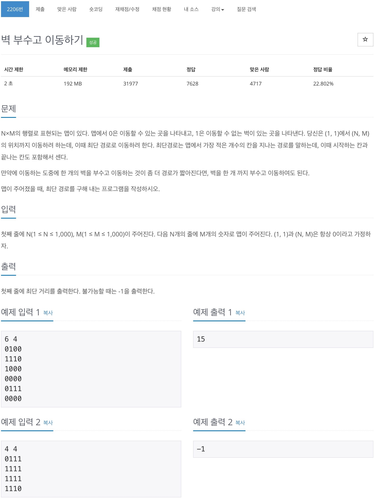

# 백준 2206 - 벽 부수고 이동하기



## 채점 현황


## 전체 소스 코드
```cpp
#include <iostream>
#include <queue>
using namespace std;

struct point {
    int y;
    int x;
    int level;
    bool isBreak;
};

queue<point> q;

int dx[4] = {1, -1, 0, 0};
int dy[4] = {0, 0, 1, -1};

int N, M;
int map[1001][1001];
bool check[1001][1001][2];
int minLevel = 100000000;

int main(void) {
    cin >> N >> M;

    for (int i = 0; i < N; i++) {
        for (int j = 0; j < M; j++) {
            scanf("%1d", &map[i][j]);
        }
    }

    bool isPass = false;
    q.push({0, 0, 1, false});
    check[0][0][0] = true;
    while (!q.empty()) {
        int y = q.front().y;
        int x = q.front().x;
        int level = q.front().level;
        bool isBreak = q.front().isBreak;
        q.pop();

        if (y == N - 1 && x == M - 1) {
            if (minLevel > level) {
                minLevel = level;
            }
            isPass = true;
        }

        for (int i = 0; i < 4; i++) {
            int ny = y + dy[i];
            int nx = x + dx[i];

            if (0 <= ny && ny < N && 0 <= nx && nx < M) {
                if (map[ny][nx] == 1) {
                    if (isBreak == false && check[ny][nx][true] == false) {
                        check[ny][nx][true] = true;
                        q.push({ny, nx, level + 1, true});
                    }
                } else {
                    if (check[ny][nx][isBreak] == false) {
                        check[ny][nx][isBreak] = true;
                        q.push({ny, nx, level + 1, isBreak});
                    }
                }
            }
        }
    }

    // for (int i = 0; i < N; i++) {
    //     for (int j = 0; j < M; j++) {
    //         cout << check[i][j] << " ";
    //     }
    //     cout << endl;
    // }
    // cout << endl;

    if (isPass == true) {
        cout << minLevel << '\n';
    } else {
        cout << -1 << '\n';
    }

    return 0;
}
```