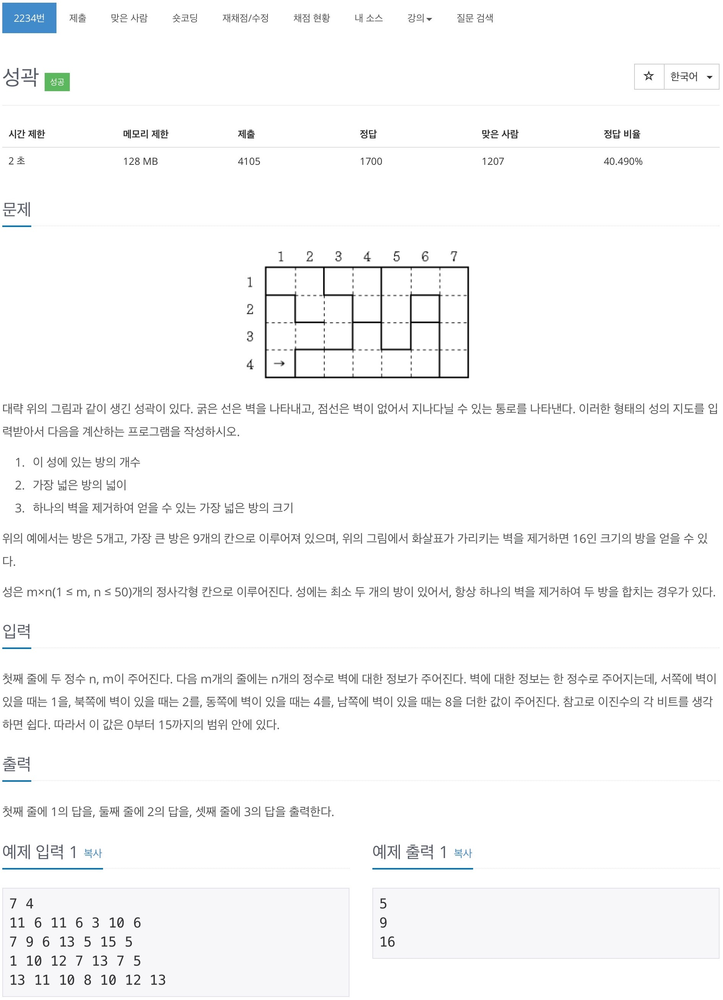

# 백준 2234 - 성곽



## 채점 현황


## 전체 소스 코드
```cpp
#include <bits/stdc++.h>
using namespace std;

int row, col;
int castle[51][51];
int colorCastle[51][51];
int num = 0;
// 동서 남북 순서
int wall[4] = {4, 1, 8, 2};
int dx[4] = {1, -1, 0, 0};
int dy[4] = {0, 0, 1, -1};
int maxRoom = 0;
vector<pair<int, int>> area[51 * 51];

void makeMaxRoom(int color) {
    for (int i = 0; i < area[color].size(); i++) {
        int cntY = area[color][i].first;
        int cntX = area[color][i].second;

        for (int i = 0; i < 4; i++) {
            int ny = cntY + dy[i];
            int nx = cntX + dx[i];
            int nextColor = colorCastle[ny][nx];

            if (ny < 0 || ny >= row || nx < 0 || nx >= col) {
                continue;
            }

            if (nextColor != color) {
                int room = area[color].size() + area[nextColor].size();
                maxRoom = max(maxRoom, room);
            }
        }
    }
}

void bfs(int y, int x, int color) {
    queue<pair<int, int>> q;
    q.push({y, x});
    colorCastle[y][x] = color;
    area[color].push_back({y, x});

    while (!q.empty()) {
        int cntY = q.front().first;
        int cntX = q.front().second;
        q.pop();

        int cntWall = castle[cntY][cntX];

        for (int i = 0; i < 4; i++) {
            int ny = cntY + dy[i];
            int nx = cntX + dx[i];

            if ((cntWall & wall[i]) != wall[i] && colorCastle[ny][nx] == 0) {
                colorCastle[ny][nx] = color;
                area[color].push_back({ny, nx});
                q.push({ny, nx});
            }
        }
    }
}

int main(void) {
    cin >> col >> row;
    for (int i = 0; i < row; i++) {
        for (int j = 0; j < col; j++) {
            cin >> castle[i][j];
        }
    }

    for (int i = 0; i < row; i++) {
        for (int j = 0; j < col; j++) {
            if (colorCastle[i][j] == 0) {
                num++;
                bfs(i, j, num);
            }
        }
    }

    for (int i = 1; i <= num; i++) {
        makeMaxRoom(i);
    }

    int maxValue = 0;
    for (int i = 1; i <= num; i++) {
        if (maxValue < area[i].size()) {
            maxValue = area[i].size();
        }
    }

    cout << num << '\n';
    cout << maxValue << '\n';
    cout << maxRoom << '\n';
}
```