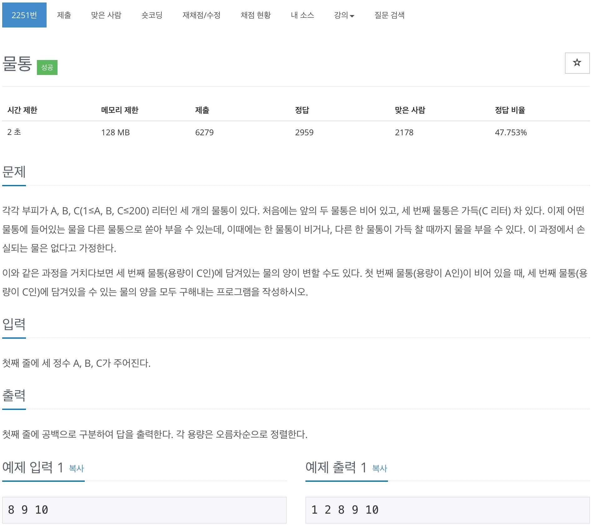
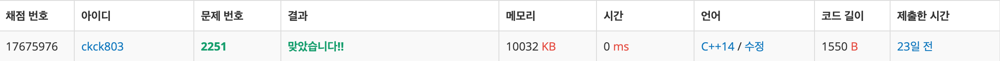

# 백준 2251 - 물통



## 채점 현황


## 전체 소스 코드
```cpp
#include <algorithm>
#include <iostream>
#include <queue>
#include <vector>
using namespace std;

int A, B, C;
vector<int> v;
bool check[202][202][202];
struct bottles {
    int a;
    int b;
    int c;
};

int main(void) {
    cin >> A >> B >> C;

    queue<bottles> q;
    q.push({0, 0, C});

    while (!q.empty()) {
        int a = q.front().a;
        int b = q.front().b;
        int c = q.front().c;
        q.pop();

        if (check[a][b][c] == false) {
            check[a][b][c] = true;
        } else {
            continue;
        }

        if (a == 0) {
            v.push_back(c);
        }

        if (a + b <= B) {
            q.push({0, a + b, c});
        } else {
            q.push({a + b - B, B, c});
        }

        if (b + c <= B) {
            q.push({a, b + c, 0});
        } else {
            q.push({a, B, b + c - B});
        }

        if (a + c <= C) {
            q.push({0, b, a + c});
        } else {
            q.push({a + c - C, b, C});
        }

        if (b + c <= C) {
            q.push({a, 0, b + c});
        } else {
            q.push({a, b + c - C, C});
        }

        if (a + b <= A) {
            q.push({a + b, 0, c});
        } else {
            q.push({A, a + b - A, c});
        }

        if (a + c <= A) {
            q.push({a + c, b, 0});
        } else {
            q.push({A, b, a + c - A});
        }
    }

    sort(v.begin(), v.end());
    for (int i = 0; i < v.size(); i++) {
        cout << v[i] << " ";
    }
    cout << endl;

    return 0;
}
```