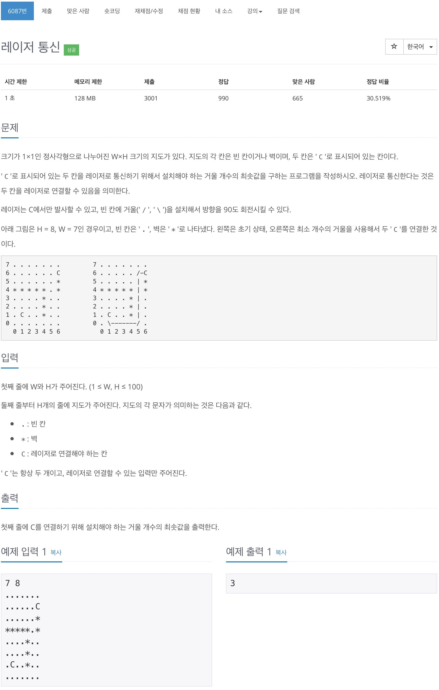
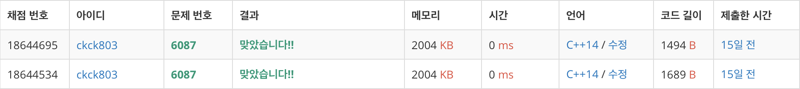

# 백준 6087 - 레이저 통신



## 채점 현황



## 전체 소스 코드
```cpp
#include <bits/stdc++.h>
using namespace std;

enum {
    N,
    W,
    E,
    S,
};

int width, height;
char Map[101][101];
bool check[101][101];
int dy[4] = {1, -1, 0, 0};
int dx[4] = {0, 0, 1, -1};
vector<pair<int, int>> cPoint;

int bfs() {
    queue<pair<int, int>> q;
    q.push({cPoint[0].first, cPoint[0].second});
    check[cPoint[0].first][cPoint[0].second] = true;

    int num = 0;
    while (!q.empty()) {
        int q_size = q.size();

        while (q_size--) {
            int cntY = q.front().first;
            int cntX = q.front().second;
            q.pop();

            for (int i = 0; i < 4; i++) {
                int ny = cntY + dy[i];
                int nx = cntX + dx[i];

                while (0 <= ny && ny < height && 0 <= nx && nx < width && Map[ny][nx] != '*') {
                    if (ny == cPoint[1].first && nx == cPoint[1].second) {
                        return num;
                    }

                    if (check[ny][nx] == false) {
                        check[ny][nx] = true;
                        q.push({ny, nx});
                    }
                    ny += dy[i];
                    nx += dx[i];
                }
            }
        }
        num++;
    }
}

int main(void) {
    cin >> width >> height;

    for (int i = 0; i < height; i++) {
        for (int j = 0; j < width; j++) {
            cin >> Map[i][j];

            if (Map[i][j] == 'C') {
                cPoint.push_back({i, j});
            }
        }
    }

    cout << bfs() << '\n';
    return 0;
}
```