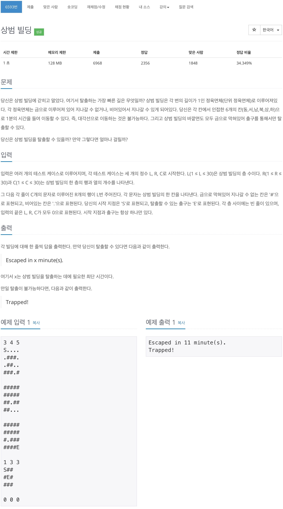

# 백준 6593 - 상범 빌딩 



## 채점 현황


## 전체 소스 코드
```cpp
#include <iostream>
#include <queue>
using namespace std;

int L, R, C;
char building[33][33][33];
int dx[6] = {1, -1, 0, 0, 0, 0};
int dy[6] = {0, 0, 1, -1, 0, 0};
int dz[6] = {0, 0, 0, 0, 1, -1};

struct point {
    int z;
    int y;
    int x;
    int num;
};

bool check[33][33][33];

int main(void) {
    while (true) {
        cin >> L >> R >> C;
        queue<point> q;

        if (L == 0 && R == 0 && C == 0) {
            break;
        }

        for (int i = 0; i < L; i++) {
            for (int j = 0; j < R; j++) {
                for (int k = 0; k < C; k++) {
                    cin >> building[i][j][k];
                    check[i][j][k] = false;

                    if (building[i][j][k] == 'S') {
                        q.push({i, j, k, 0});
                        check[i][j][k] = true;
                    }
                }
            }
        }

        bool isPass = true;
        while (!q.empty()) {
            int z = q.front().z;
            int y = q.front().y;
            int x = q.front().x;
            int num = q.front().num;
            q.pop();

            if (building[z][y][x] == 'E') {
                cout << "Escaped in " << num << " minute(s)." << '\n';
                isPass = false;
                break;
            }

            for (int i = 0; i < 6; i++) {
                int nz = z + dz[i];
                int ny = y + dy[i];
                int nx = x + dx[i];

                if (0 <= nz && nz < L && 0 <= ny && ny < R && 0 <= nx && nx < C) {
                    if (check[nz][ny][nx] == false && building[nz][ny][nx] != '#') {
                        q.push({nz, ny, nx, num + 1});
                        check[nz][ny][nx] = true;
                    }
                }
            }
        }

        if (isPass) {
            cout << "Trapped!" << '\n';
        }
    }

    return 0;
}
```