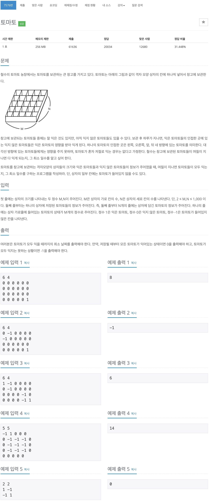
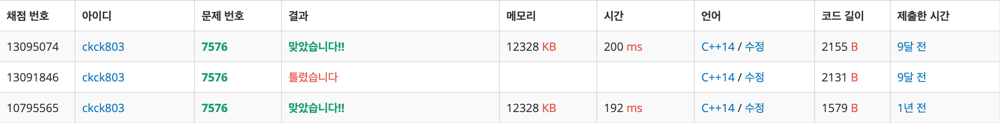

# 백준 7576 - 토마토



## 채점 현황


## 상자를 초기화 하는 부분

```cpp
cin >> m >> n;
for (int i = 0; i < n; i++)
{
    for (int j = 0; j < m; j++)
    {
        cin >> box[i][j];
        if (box[i][j] == 1)
        {
            tomato tmp(i,j,0);
            q.push(tmp);
        }
    }
}
```

입력은 행렬의 형태로 들어오게 된다.
즉, 행렬의 원소를 한번씩 도는 형태로 값이 들어온다.  
입력 받은 값을 해당 box배열에 대입 시켜준다.  
만약, 처음 입력 받은 값이 1일 경우에는 해당 좌표와 함께 경과한 일자 즉, 0을 queue에 함께 넣어준다.

## 주변 부분을 순회하는 부분

```cpp
while (!q.empty())
{
    tomato cnt = q.front();
    q.pop();
    int row = cnt.row;
    int col = cnt.col;
    int date = cnt.date;

    // 오른쪽
    if (row + 1 < n)
    {
        int con = box[row+1][col];
        if (con == 0)
        {
            box[row+1][col] = 1;
            tomato next(row+1, col, date+1);
            q.push(next);
        }
    }
    // 왼쪽
    if (row - 1 >= 0)
    {
        int con = box[row-1][col];
        if (con == 0)
        {
            box[row-1][col] = 1;
            tomato next(row-1, col, date+1);
            q.push(next);
        }
    }
    // 위
    if (col - 1 >= 0)
    {
        int con = box[row][col-1];
        if(con == 0)
        {
            box[row][col-1] = 1;
            tomato next(row, col-1, date+1);
            q.push(next);
        }
    }
    // 아래
    if (col + 1 <= m)
    {
        int con = box[row][col+1];
        if(con == 0)
        {
            box[row][col+1] = 1;
            tomato next(row, col+1, date+1);
            q.push(next);
        }
    }


    if(date>day)
        day = date;
}
```

#### 범위를 생각해보자!<br>

하나의 익은 토마토는 상, 하, 좌, 우에 있는 안 익은 토마토들이 익을 수 있도록 해준다.<br>
한 토마토가 영향을 미칠 수 있는 범위는, 왼쪽으로는 0에서부터 시작해 오른쪽으로는 최대 n까지 위로는 0에서부터 시작해서 아래로는 최대 m까지의 범위를 갖는다.<br>
<br>

1. 한 토마토가 다음 위치로 움직이는 위치가 범위를 벗어나지 않았는지 확인
2. 만약 범위내에 있다고 하면 토마토의 상태를 확인한다.
3. 토마토의 상태가 0 즉, 익지 않은 상태라고 하면 해당 토마토의 상태를 1로 변경해주고, 다음 위치를 queue에 넣어준다.
4. day값을 해당 토마토들의 date와 비교를 하면서 계속 갱신시켜준다.

### 순회 하는 부분을 간단히 만든 코드

```cpp
// 오른쪽, 왼쪽, 위, 아래
int dx[4] = {1, -1, 0,0};
int dy[4] = {0, 0, -1, 1};
for(int i=0; i<4; i++)
{
    int x = col + dx[i];
    int y = row + dy[i];
    if(0<=x && x<m && 0<=y && y<n)
    {
        if(box[y][x] == 0)
        {
            box[y][x] = 1;
            tomato next(x, y, date+1);
            q.push(next);
        }
    }
}
```

## 전체 코드

```cpp
#include <iostream>
#include <queue>
using namespace std;

int box[1001][1001];
int n, m, day;
class tomato
{
public:
    int row, col, date;

    tomato(int i, int j, int d)
    {
        row = i;
        col = j;
        date = d;
    }
};

queue<tomato> q;

int main(void)
{
    cin >> m >> n;
    for (int i = 0; i < n; i++)
    {
        for (int j = 0; j < m; j++)
        {
            cin >> box[i][j];
            if (box[i][j] == 1)
            {
                tomato tmp(i,j,0);
                q.push(tmp);
            }
        }
    }

    while (!q.empty())
    {
        tomato cnt = q.front();
        q.pop();
        int row = cnt.row;
        int col = cnt.col;
        int date = cnt.date;

        // 오른쪽, 왼쪽, 위, 아래
        int dx[4] = {1, -1, 0,0};
        int dy[4] = {0, 0, -1, 1};
        for(int i=0; i<4; i++)
        {
            int x = col + dx[i];
            int y = row + dy[i];
            if(0<=x && x<m && 0<=y && y<n)
            {
                if(box[y][x] == 0)
                {
                    box[y][x] = 1;
                    tomato next(x, y, date+1);
                    q.push(next);
                }
            }
        }


        if(date>day)
            day = date;
    }

    for(int i=0; i<n; i++)
    {
        for(int j=0; j<m; j++)
        {
            if(box[i][j] == 0)
            {
                cout<<-1<<'\n';
                return 0;
            }
        }
    }
    cout<<day<<'\n';
    return 0;
}
```
