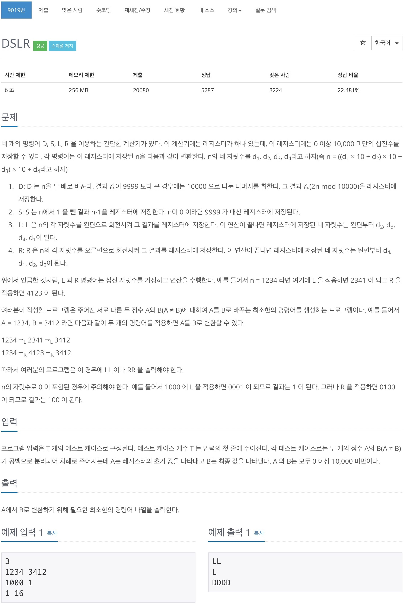
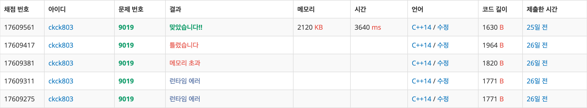

# 백준 9019 - DSLR



## 채점 현황



## 전체 소스 코드
```cpp
#include <iostream>
#include <queue>
#include <string>
#include <vector>
using namespace std;

int T;
int A, B;
struct reg {
    int cnt;
    int num;
    string s;
};

int main(void) {
    cin >> T;

    while (T--) {
        cin >> A >> B;
        queue<reg> q;
        vector<bool> check(10001, false);

        q.push({A, 0, ""});
        check[A] = true;

        while (!q.empty()) {
            int cnt = q.front().cnt;
            int num = q.front().num;
            string s = q.front().s;
            q.pop();

            if (cnt == B) {
                cout << s << '\n';
                break;
            }

            int cntD = cnt * 2;
            if (cntD > 9999) {
                cntD %= 10000;
            }
            if (check[cntD] == false) {
                check[cntD] = true;
                q.push({cntD, num + 1, s + 'D'});
            }

            int cntS;
            if (cnt == 0) {
                cntS = 9999;
            } else {
                cntS = cnt - 1;
            }
            if (check[cntS] == false) {
                check[cntS] = true;
                q.push({cntS, num + 1, s + 'S'});
            }

            int cntL = (cnt % 1000) * 10;
            cntL += (cnt / 1000);
            if (check[cntL] == false) {
                check[cntL] = true;
                q.push({cntL, num + 1, s + 'L'});
            }

            int cntR = cnt / 10;
            cntR += 1000 * (cnt % 10);
            if (check[cntR] == false) {
                check[cntR] = true;
                q.push({cntR, num + 1, s + 'R'});
            }
        }
    }

    return 0;
}
```