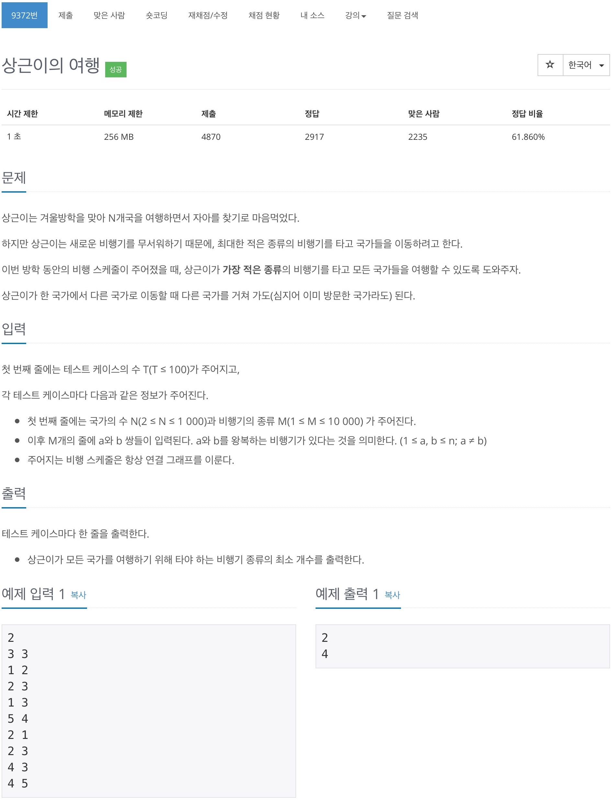
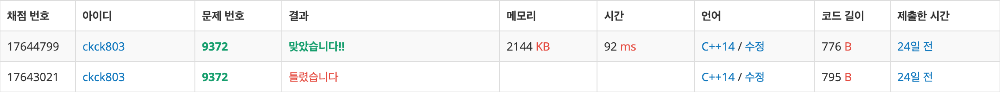

# 백준 9372 - 상근이의 여행



## 채점 현황


## 전체 소스 코드
```cpp
#include <iostream>
#include <queue>
#include <vector>
using namespace std;

int T;
int N, M;

int main(void) {
    cin >> T;

    while (T--) {
        cin >> N >> M;
        cout << N - 1 << endl;

        vector<vector<int>> v(N + 1);
        vector<bool> check(N + 1, false);
        for (int i = 0; i < M; i++) {
            int a, b;
            cin >> a >> b;

            v[a].push_back(b);
            v[b].push_back(a);
        }

        // int minValue = 1000000;
        // for(int i=1; i<=N; i++){
        //     queue<pair<int, int>>q;
        //     q.push({i, 0});

        //     while(!q.empty()){
        //         int cnt = q.front().first;
        //         int num = q.front().second;
        //         q.pop();

        //     }
        // }
    }
}
```