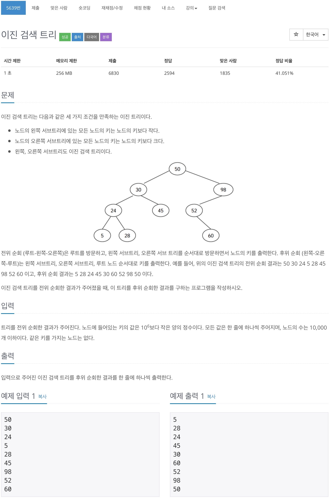
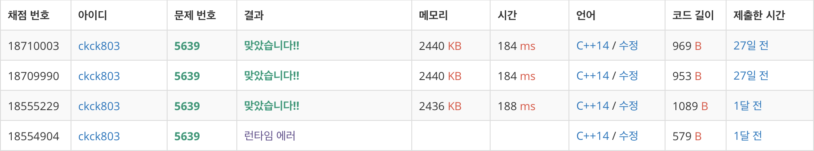

# 백준 5639 - 이진 검색 트리



## 채점 현황



## 전체 소스 코드
```cpp
#include <bits/stdc++.h>
using namespace std;

class Node {
   public:
    int value;
    int depth;

    Node* left;
    Node* right;

   public:
    Node(int& value) {
        this->value = value;
        this->depth = 0;
        this->left = NULL;
        this->right = NULL;
    }

    void setLeft(Node* newNode) {
        this->left = newNode;
    }

    void setRight(Node* newNode) {
        this->right = newNode;
    }
};

Node* insert(Node* root, Node* node) {
    if (root == NULL) {
        return node;
    } else if (root->value > node->value) {
        root->setLeft(insert(root->left, node));
    } else {
        root->setRight(insert(root->right, node));
    }
    return root;
}

void PostOrder(Node* tree) {
    if (tree->left != NULL) {
        PostOrder(tree->left);
    }

    if (tree->right != NULL) {
        PostOrder(tree->right);
    }

    cout << tree->value << '\n';
}

int main(void) {
    int value;
    Node* tree = NULL;
    while (scanf("%d", &value) != EOF) {
        tree = insert(tree, new Node(value));
    }

    PostOrder(tree);

    return 0;
}
```