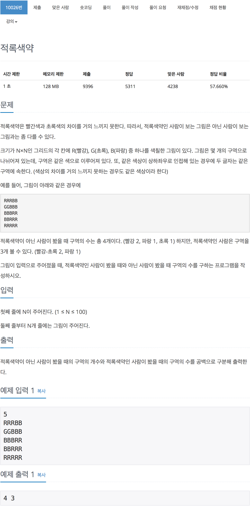

# 백준 10026 - 적록색약

[10026 - 적록색약](https://www.acmicpc.net/problem/10026)



```cpp
void dfs1(int y, int x, char color)
{
    // cout << y << ' ' << x << ' ' << color << endl;
    for (int i = 0; i < 4; i++)
    {
        int ny = y + dy[i];
        int nx = x + dx[i];

        if (0 <= ny && ny < n && 0 <= nx && nx < n)
        {
            if (!visited_1[ny][nx] && arr[ny][nx] == color)
            {
                visited_1[ny][nx] = true;
                dfs1(ny, nx, color);
            }
        }
    }
}
```

```cpp
void dfs2(int y, int x, char color)
{
    for (int i = 0; i < 4; i++)
    {
        int ny = y + dy[i];
        int nx = x + dx[i];

        if (0 <= ny && ny < n && 0 <= x && x < n)
        {
            if (!visited_2[ny][nx])
            {
                if (color == 'B' && arr[ny][nx] == color)
                {
                    visited_2[ny][nx] = true;
                    dfs2(ny, nx, color);
                }
                else if (color != 'B' && (arr[ny][nx] == 'R' | arr[ny][nx] == 'G'))
                {
                    visited_2[ny][nx] = true;
                    dfs2(ny, nx, color);
                }
            }
        }
    }
}
```

```cpp
#include <iostream>
using namespace std;

int n;
char arr[101][101];
bool visited_1[101][101];
bool visited_2[101][101];
int area_1, area_2;
int dy[4] = {1, -1, 0, 0};
int dx[4] = {0, 0, 1, -1};

void dfs1(int y, int x, char color)
{
    // cout << y << ' ' << x << ' ' << color << endl;
    for (int i = 0; i < 4; i++)
    {
        int ny = y + dy[i];
        int nx = x + dx[i];

        if (0 <= ny && ny < n && 0 <= nx && nx < n)
        {
            if (!visited_1[ny][nx] && arr[ny][nx] == color)
            {
                visited_1[ny][nx] = true;
                dfs1(ny, nx, color);
            }
        }
    }
}

void dfs2(int y, int x, char color)
{
    for (int i = 0; i < 4; i++)
    {
        int ny = y + dy[i];
        int nx = x + dx[i];

        if (0 <= ny && ny < n && 0 <= x && x < n)
        {
            if (!visited_2[ny][nx])
            {
                if (color == 'B' && arr[ny][nx] == color)
                {
                    visited_2[ny][nx] = true;
                    dfs2(ny, nx, color);
                }
                else if (color != 'B' && (arr[ny][nx] == 'R' | arr[ny][nx] == 'G'))
                {
                    visited_2[ny][nx] = true;
                    dfs2(ny, nx, color);
                }
            }
        }
    }
}

int main(void)
{
    scanf("%d\n", &n);
    for (int i = 0; i < n; i++)
        for (int j = 0; j < n; j++)
            scanf("%c\n", &arr[i][j]);

    for (int i = 0; i < n; i++)
        for (int j = 0; j < n; j++)
            if (!visited_1[i][j])
            {
                visited_1[i][j] = true;
                char color = arr[i][j];
                area_1++;
                dfs1(i, j, color);
            }

    for (int i = 0; i < n; i++)
        for (int j = 0; j < n; j++)
            if (!visited_2[i][j])
            {
                visited_2[i][j] = true;
                char color = arr[i][j];
                area_2++;
                dfs2(i, j, color);
            }

    cout << area_1 << " " << area_2 << '\n';

    return 0;
}
```
