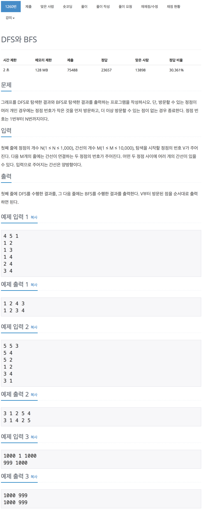

# 백준 1260 - DFS와 BFS

[1260 - DFS와 BFS](https://www.acmicpc.net/problem/1260)



```cpp
void dfs(int cnt)
{
    dfs_visited[cnt] = true;
    cout << cnt << " ";

    // 현재 노드에 연결되어 있는 간선의 개수를 파악한다.
    int size = line[cnt].size();

    for (int i = 0; i < size; i++)
    {
        int next = line[cnt][i];
        if (dfs_visited[next] == false)
        {
            dfs(next);
        }
    }
}
```

```cpp
void bfs()
{
bfs_check[v] = true;

    while (!q.empty())
    {
        int cnt = q.front();
        q.pop();
        cout << cnt << " ";

        int line_num = line[cnt].size();
        for (int i = 0; i < line_num; i++)
        {
            int node = line[cnt][i];
            if (bfs_check[node] == false)
            {
                bfs_check[node] = true;
                q.push(node);
            }
        }
    }
}
```

```cpp
#include <iostream>
#include <vector>
#include <algorithm>
#include <queue>
using namespace std;

queue<int> q;

// n은 정점의 개수, m은 간선의 개수, v시작 점이다.
int n, m, v;
vector<vector<int>> line;
bool dfs_visited[1000];
bool bfs_check[1000];

void dfs(int cnt)
{
    dfs_visited[cnt] = true;
    cout << cnt << " ";

    // 현재 노드에 연결되어 있는 간선의 개수를 파악한다.
    int size = line[cnt].size();

    for (int i = 0; i < size; i++)
    {
        int next = line[cnt][i];
        if (dfs_visited[next] == false)
        {
            dfs(next);
        }
    }
}

void bfs()
{
    bfs_check[v] = true;

    while (!q.empty())
    {
        int cnt = q.front();
        q.pop();
        cout << cnt << " ";

        int line_num = line[cnt].size();
        for (int i = 0; i < line_num; i++)
        {
            int node = line[cnt][i];
            if (bfs_check[node] == false)
            {
                bfs_check[node] = true;
                q.push(node);
            }
        }
    }
}

int main(void)
{
    cin >> n >> m >> v;

    line = vector<vector<int>>(n + 1);

    for (int i = 0; i < m; i++)
    {
        int a, b;
        cin >> a >> b;
        line[a].push_back(b);
        line[b].push_back(a);
    }
    for (int i = 1; i <= n; i++)
    {
        sort(line[i].begin(), line[i].end());
    }

    dfs(v);
    cout << "\n";
    q.push(v);
    bfs();

    return 0;
}
```
