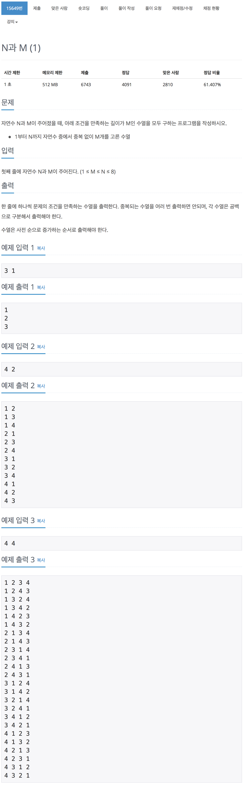

# 백준 15649 - N과 M(1)

[15649 - N과 M(1)](https://www.acmicpc.net/problem/15649)



```cpp
#include <iostream>
using namespace std;

const int MAX = 8 + 1;
int N, M;
int arr[MAX];
bool visited[MAX];

void dfs(int depth)
{
    // 깊이가 M에 도달 하면
    // arr의 모든 값들을 출력해준다.
    if (depth == M)
    {
        for (int i = 0; i < M; i++)
            cout << arr[i] << " ";
        cout << "\n";
        return;
    }

    // 1 -> N까지 돌면서
    // 선택한 상태가 아닌 것들을 선택 해준다.
    for (int i = 1; i <= N; i++)
    {
        if (!visited[i])
        {
            visited[i] = true;
            arr[depth] = i;
            dfs(depth + 1);
            visited[i] = false;
        }
    }
}

int main(void)
{
    cin >> N >> M;

    dfs(0);
    return 0;
}
```
