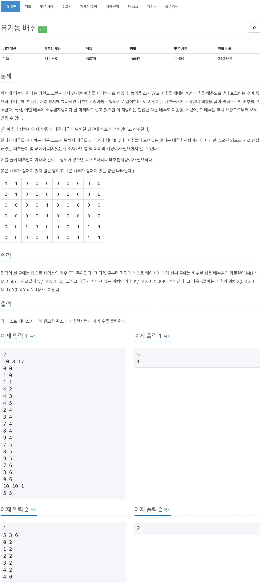
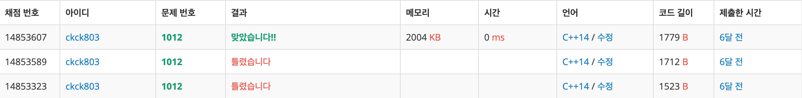

# 백준 1012 - 유기농 배추



## 채점 현황



## 전체 소스 코드
```cpp
#include <iostream>
#include <queue>
using namespace std;

// 테스트 케이스 개수
int T;
// 배추밭의 가로, 세로, 개수
int M, N, K;
int arr[55][55];
bool checked[55][55];
queue<pair<int, int>> q;
// 방향
int dx[4] = {0, 0, 1, -1};
int dy[4] = {1, -1, 0, 0};
// 지렁이 개수
int num;

void bfs()
{
    num++;
    while (!q.empty())
    {
        pair<int, int> temp = q.front();
        q.pop();
        int y = temp.first;
        int x = temp.second;

        for (int i = 0; i < 4; i++)
        {
            int next_y = y + dy[i];
            int next_x = x + dx[i];

            // 좌표 유효성 검사
            if (0 <= next_y && next_y < N && 0 <= next_x && next_x < M)
            {
                // 방문가능여부 검사
                if (arr[next_y][next_x] == 1 && checked[next_y][next_x] == false)
                {
                    checked[next_y][next_x] = true;
                    q.push(make_pair(next_y, next_x));
                }
            }
        }
    }
}

int main(void)
{
    scanf("%d", &T);

    while (T--)
    {
        scanf("%d %d %d", &M, &N, &K);
        num = 0;

        for (int i = 0; i < K; i++)
        {
            int x, y;
            scanf("%d %d", &x, &y);

            arr[y][x] = 1;
        }

        for (int i = 0; i < N; i++)
        {
            for (int j = 0; j < M; j++)
            {
                if (arr[i][j] == 1 && checked[i][j] == false)
                {
                    checked[i][j] = true;
                    q.push(make_pair(i, j));
                    bfs();
                }
            }
        }
        printf("%d\n", num);

        // 한번 썻던거 모두 0으로 다시 초기화
        for (int i = 0; i < N; i++)
        {
            for (int j = 0; j < M; j++)
            {
                arr[i][j] = 0;
                checked[i][j] = false;
            }
        }
    }

    return 0;
}
```
