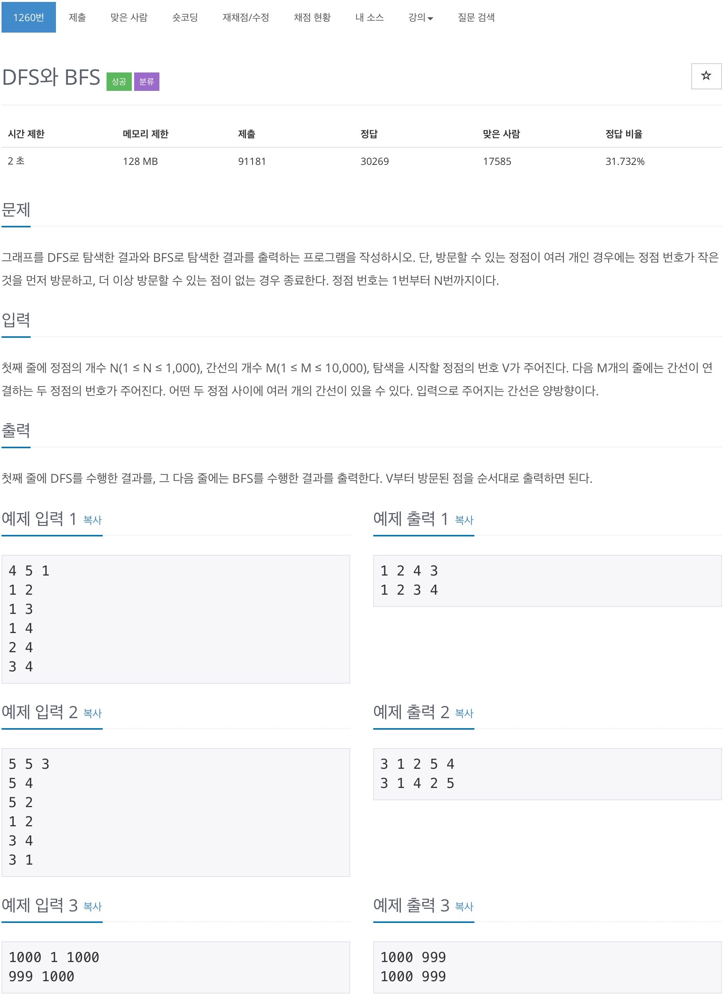

# 백준 1260 - DFS와 BFS



## cpp 코드
```cpp
#include <bits/stdc++.h>
using namespace std;

int N, M, V;
int map[1001][1001];
bool dfs_check[1001];
bool bfs_check[1001];

void dfs(int node) {
    cout << node << ' ';
    dfs_check[node] = true;
    for (int i = 1; i <= N; i++) {
        if (::map[node][i] == 1 && dfs_check[i] == false) {
            dfs(i);
        }
    }
}

void bfs(int start) {
    queue<int> q;
    q.push(start);
    bfs_check[start] = true;

    cout << start << ' ';

    while (!q.empty()) {
        int cnt = q.front();
        q.pop();

        for (int i = 1; i <= N; i++) {
            if (::map[cnt][i] == 1 && bfs_check[i] == false) {
                bfs_check[i] = true;
                q.push(i);
                cout << i << ' ';
            }
        }
    }
}

int main(void) {
    cin >> N >> M >> V;

    for (int i = 0; i < M; i++) {
        int a, b;
        cin >> a >> b;

        ::map[a][b] = 1;
        ::map[b][a] = 1;
    }

    dfs(V);
    cout << '\n';
    bfs(V);
    cout << '\n';

    return 0;
}
```

## python 코드
```python
def bfs(start):
    queue = [start]
    bfs_check = [start]

    while queue:
        cnt_node = queue.pop(0)

        for next_node in range(len(matrix[cnt_node])):
            if(matrix[cnt_node][next_node] == 1 and next_node not in bfs_check):
                bfs_check.append(next_node)
                queue.append(next_node)

    return bfs_check


def dfs(cnt_node):
    dfs_check.append(cnt_node)

    for next_node in range(len(matrix[cnt_node])):
        if(matrix[cnt_node][next_node] == 1 and next_node not in dfs_check):
            dfs(next_node)


N, M, V = map(int, input().split())
matrix = [[0] * (N+1) for i in range(N+1)]
dfs_check = []

for i in range(M):
    point = list(map(int, input().split()))
    matrix[point[0]][point[1]] = 1
    matrix[point[1]][point[0]] = 1

dfs(V)
print(*dfs_check)
print(*bfs(V))
```