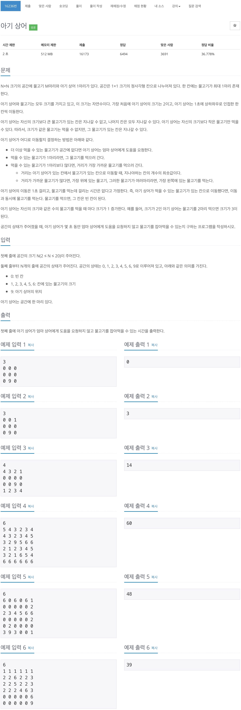
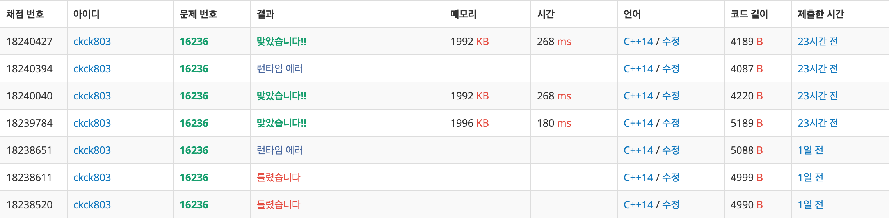

# 백준 16236 - 아기상어



## 채점 현황


## 틀린 이유
### 아기 상어의 크기는 9 이상이 될 수 있다.
```cpp
// 9할 필요 없었고 6까지 해도 충분 했을 듯...
if (size > 9) {
    size = 9;
}
```
상어의 크기는 `9`이상이 될 수 있지만, 물고기의 크기는 `6`이상일 수 없으므로 해당 조건을 통해 물고기 범위에 어느정도 제한을 두어야 한다.

### 아기 상어가 갈 수 없는 물고기를 제대로 고려하지 못했다.
```cpp
pair<int, int> calDist(int size, int y, int x) {
    int Mindist = INF;
    int fishSize = 0;
    int index = 0;
    pair<int, int> point;

    if (size > 9) {
        size = 9;
    }

    for (int i = 1; i < size; i++) {
        int cntSize = i;

        for (int j = 0; j < fishes[cntSize].size(); j++) {
            if (Ate[cntSize][j] == false) {
                int d = bfs(y, x, fishes[cntSize][j].first, fishes[cntSize][j].second, size);

                if (Mindist > d) {
                    Mindist = d;
                    fishSize = cntSize;
                    index = j;
                    point = {fishes[cntSize][j].first, fishes[cntSize][j].second};
                } else if (Mindist == d) {
                    if (!cmp(point, fishes[cntSize][j])) {
                        fishSize = cntSize;
                        index = j;
                        point = fishes[cntSize][j];
                    }
                }
            }
        }
    }
    return {fishSize, index};
}
```
위의 식의 경우 아기 상어가 갈 수 없는 물고기에 대해서도 `Mindeis == d`연산이 이루어지게 되서 잘못된 답이 나오게 된다. 때문에, 아기상어가 갈 수 없는 물고기에 대한 예외처리가 필요하다.

## 문제 풀이
생각보다 까라롭다라고 생각하면 까다롭다고 할 수 있다. 아기상어의 크기와 물고기의 크기들을 고려 하면서 문제를 해결하려 나가야 한다. 아기 상어가 먹을 수 있는 크기의 물고기에게 갈 수 있는지도 확인을 해주어야 한다.
1. 상어가 먹을 수 있는 물고기가 있는지 확인한다.
   1. 상어보다 크기가 작으면서, 도달 할 수 있는지 확인을 해야 한다.
   2. 있으면 물고기의 좌표를 반환하게 한다.
   3. 만약 아무것도 없으면 `(0, 0)`을 반환하게 한다.
2. 상어가 먹을 수 있는 물고기가 없는 경우 끝낸다.
3. 먹을 수 있는 물고기가 있는 경우 물고기 갯수를 줄이고, 상어가 먹은 갯수를 늘려주고 상어의 크기와 비교한 후 같다면 갱신해준다.
4. 시간에다 상어가 먹은 물고까지의 거리를 더해준다.


## 입력 받기
```cpp
for (int i = 0; i < N; i++) {
    for (int j = 0; j < N; j++) {
        cin >> map[i][j];

        if (map[i][j] == 9) {
            startY = i;
            startX = j;
            map[i][j] = 0;
        } else {
            if (map[i][j] != 0) {
                // map[i][j]는 물고기의 크기이다.
                // fish는 물고기 크기에 따른 물고기의 좌표들을 저장하기 위한 배열
                fishes[map[i][j]].push_back({i, j});
                // Ate는 해당 물고기가 먹혔는지 안먹혔는지를 확인하기 위한 배열
                Ate[map[i][j]].push_back(false);
                fishNum++;
            }
        }
    }
}
```
값을 입력 받을 때 아기상어가 들어오게 되면 위치를 저장해 놓고, 0을 놓는다. 만약 물고기가 들어오는 경우에는 물고기의 크기를 index로 삼아 물고기 좌표를 저장한다. `Ate`배열은 해당 물고기가 먹혔는지 안먹혔는지 확인하기 위한 배열이다.


## 정렬하기
```cpp
bool cmp(pair<int, int> a, pair<int, int> b) {
    if (a.first == b.first) {
        return a.second < b.second;
    } else {
        return a.first < b.first;
    }
}

for (int i = 1; i < 10; i++) {
    sort(fishes[i].begin(), fishes[i].end(), cmp);
}
```
물고기를 가장 위에 있는 순으로, 가장 위의 있는 것들이 같으면 가장 왼쪽에 있는 순으로 물고기들을 정렬시켜준다.

## 아기상어 움직이기
```cpp
while (!q.empty()) {
    int cntY = q.front().y;
    int cntX = q.front().x;
    int cntSize = q.front().size;
    int cntEat = q.front().eat;
    q.pop();

    if (fishNum > 0) {
        // 현재 상어와 먹을 수 있는 물고기의 좌표를 알아낸다.
        fishPoint = calDist(cntSize, cntY, cntX);

        // 상어가 먹을 수 있는 물고기가 존재하지 않을 경우 나간다.
        if (fishPoint.first == 0 && fishPoint.second == 0) {
            break;
        }

        // 상어가 먹을 물고기가 존재하는 경우, 그 물고기를 먹고 물고기 갯수를 줄인다.
        Ate[fishPoint.first][fishPoint.second] = true;
        fishNum--;

        // 상어와 물고기와의 거리를 계산한다.
        pair<int, int> fish = fishes[fishPoint.first][fishPoint.second];
        int d = bfs(cntY, cntX, fish.first, fish.second, cntSize);

        // 상어가 먹은 물고기의 갯수를 늘려준다.
        cntEat++;
        // 만일 먹은 물고기 갯수와 상어의 크기가 같다면 상어의 크기를 늘려주고, 먹은 갯수를 초기화 해준다.
        if (cntEat == cntSize) {
            cntSize++;
            cntEat = 0;
        }

        // 물고기를 먹으러 간 거리만큼 시간을 더해준다.
        totalTime += d;
        q.push({fish.first, fish.second, cntSize, cntEat});
    }
}
```
1. 현재 상어가 먹을 수 있는 물고기의 좌표를 알아낸다.
2. 만일 상어가 먹을 수 있는 물고기가 없을 경우에는 그냥 나간다.
3. 상어가 먹을 수 있는 물고기가 존재하는 경우에는 해당 물고기를 `true`로 해서 먹었다고 한다음 물고기의 갯수를 줄인다.
4. 얻어낸 물고기 좌표를 통해 상어와 물고기 거리를 계산한다.
5. 상어가 먹은 물고기 갯수를 늘려주고, 상어의 크기와 비교해서 같다면 상어의 크기를 늘려주고, 먹은 갯수를 초기화 한다.
6. 물고기를 먹으러 간 거리만큼 시간을 더해준다.


## 먹을 수 있는 물고기와의 거리 계산하기
```cpp
pair<int, int> calDist(int size, int y, int x) {
    int Mindist = INF;
    int fishSize = 0;
    int index = 0;
    pair<int, int> point;

    // 9할 필요 없었고 6까지 해도 충분 했을 듯...
    if (size > 9) {
        size = 9;
    }

    // 1 ~ size까지의 물고기크기 (물고기 최대크기는 6까지임)
    for (int i = 1; i < size; i++) {
        int cntSize = i;

        for (int j = 0; j < fishes[cntSize].size(); j++) {
            // 아직 해당 물고기를 안먹었으면 dfs를 이용해 거리를 계산해준다.
            // 좌표 평면 거리(y2-y1) + (x2 - x1)를 통해 계산을 안하는 이유는 가다가 막히는 경우가 생기기 때문이다.
            if (Ate[cntSize][j] == false) {
                int d = bfs(y, x, fishes[cntSize][j].first, fishes[cntSize][j].second, size);

                // 아기상어가 갈 수 없을 경우, 건너뛴다.
                if (d == INF) {
                    continue;
                }

                // 최소 거리와 비교해준다.
                if (Mindist > d) {
                    Mindist = d;
                    fishSize = cntSize;
                    index = j;
                    point = {fishes[cntSize][j].first, fishes[cntSize][j].second};
                    //거리가 같을 경우
                } else if (Mindist == d) {
                    if (!cmp(point, fishes[cntSize][j])) {
                        fishSize = cntSize;
                        index = j;
                        point = fishes[cntSize][j];
                    }
                }
            }
        }
    }
    // 물고기의 크기와 물고기 좌표의 위치를 반환한다.
    return {fishSize, index};
}
```
아기 상어가 9보다 클 경우 물고기의 최대 사이즈를 9로 놓고 `1 ~ size` 물고기 크기를 바꿔가면서 거리를 계산한다.
1. 현재 사의즈의 물고기들을 확인하면서, 먹지 않은 물고기가 있다면 `bfs`를 이용해 거리를 계산해준다.
2. 아기상어가 갈 수 없는 경우`INF`에는 해당 물고기는 건너뛴다.
3. `구해준 거리`를 `최소 거리`와 비교했을 때 더 작으면 `최소 거리`, `물고기 크기`, 해당 `물고기의 좌표의 index`를 갱신해준다. 만약 같은 거리 값이 나오면 더 위쪽에 있는지, 아니면 더 왼쪽에 있는지 확인 한다음 더 위쪽 or 같은 위쪽이면서 더 왼쪽에 있을 경우 값을 갱신시켜준다.
4. 반환 값으로 `물고기의 크기`와 물고기 `좌표의 위치`를 반환한다. 만약, 상어가 갈 수 있는 물고기가 없을 경우에는 `{0, 0}`을 반환하게 될 것이다.


## bfs를 이용하여 상어와 물고기 거리 구하기
```cpp
int bfs(int y, int x, int fishY, int fishX, int size) {
    struct point {
        int y;
        int x;
        int dist;
    };
    vector<vector<bool>> check(N, vector<bool>(N, false));

    queue<point> q;
    q.push({y, x, 0});
    check[y][x] = true;

    int Mindist = INF;

    while (!q.empty()) {
        int cntY = q.front().y;
        int cntX = q.front().x;
        int cntDist = q.front().dist;
        q.pop();

        // cout << cntY << " " << cntX << endl;

        if (cntY == fishY && cntX == fishX) {
            return cntDist;
        }

        for (int i = 0; i < 4; i++) {
            int ny = cntY + dy[i];
            int nx = cntX + dx[i];

            if (0 <= ny && ny < N && 0 <= nx && nx < N) {
                if (check[ny][nx] == false && map[ny][nx] <= size) {
                    check[ny][nx] = true;
                    q.push({ny, nx, cntDist + 1});
                }
            }
        }
    }

    return Mindist;
}
```
`bfs`를 이용하여 상어와 물고기와의 최단거리를 구해준다. 만약, 최단거리가 존재하지 않을 경우 `INF`값을 반환한다.


```cpp
#include <algorithm>
#include <iostream>
#include <queue>
#include <vector>
using namespace std;

#define INF 987654321

int N;
int map[22][22];
int startY, startX;
int totalTime = 0;
struct shark {
    int y;
    int x;
    int size;
    int eat;
};
int dx[4] = {1, -1, 0, 0};
int dy[4] = {0, 0, 1, -1};
queue<shark> q;
vector<vector<pair<int, int>>> fishes(10);
vector<vector<bool>> Ate(10);
int fishNum;

bool cmp(pair<int, int> a, pair<int, int> b) {
    if (a.first == b.first) {
        return a.second < b.second;
    } else {
        return a.first < b.first;
    }
}

int bfs(int y, int x, int fishY, int fishX, int size) {
    struct point {
        int y;
        int x;
        int dist;
    };
    vector<vector<bool>> check(N, vector<bool>(N, false));

    queue<point> q;
    q.push({y, x, 0});
    check[y][x] = true;

    int Mindist = INF;

    while (!q.empty()) {
        int cntY = q.front().y;
        int cntX = q.front().x;
        int cntDist = q.front().dist;
        q.pop();

        if (cntY == fishY && cntX == fishX) {
            return cntDist;
        }

        for (int i = 0; i < 4; i++) {
            int ny = cntY + dy[i];
            int nx = cntX + dx[i];

            if (0 <= ny && ny < N && 0 <= nx && nx < N) {
                if (check[ny][nx] == false && map[ny][nx] <= size) {
                    check[ny][nx] = true;
                    q.push({ny, nx, cntDist + 1});
                }
            }
        }
    }

    return Mindist;
}

pair<int, int> calDist(int size, int y, int x) {
    int Mindist = INF;
    int fishSize = 0;
    int index = 0;
    pair<int, int> point;

    // 9할 필요 없었고 6까지 해도 충분 했을 듯...
    if (size > 9) {
        size = 9;
    }

    // 1 ~ size까지의 물고기크기 (물고기 최대크기는 6까지임)
    for (int i = 1; i < size; i++) {
        int cntSize = i;

        for (int j = 0; j < fishes[cntSize].size(); j++) {
            // 아직 해당 물고기를 안먹었으면 dfs를 이용해 거리를 계산해준다.
            // 좌표 평면 거리(y2-y1) + (x2 - x1)를 통해 계산을 안하는 이유는 가다가 막히는 경우가 생기기 때문이다.
            if (Ate[cntSize][j] == false) {
                int d = bfs(y, x, fishes[cntSize][j].first, fishes[cntSize][j].second, size);

                // 아기상어가 갈 수 없을 경우, 건너뛴다.
                if (d == INF) {
                    continue;
                }

                // 최소 거리와 비교해준다.
                if (Mindist > d) {
                    Mindist = d;
                    fishSize = cntSize;
                    index = j;
                    point = {fishes[cntSize][j].first, fishes[cntSize][j].second};
                    //거리가 같을 경우
                } else if (Mindist == d) {
                    if (!cmp(point, fishes[cntSize][j])) {
                        fishSize = cntSize;
                        index = j;
                        point = fishes[cntSize][j];
                    }
                }
            }
        }
    }
    return {fishSize, index};
}

int dist(int fishY, int fishX, int y, int x) {
    return abs(fishY - y) + abs(fishX - x);
}

int main(void) {
    cin >> N;

    for (int i = 0; i < N; i++) {
        for (int j = 0; j < N; j++) {
            cin >> map[i][j];

            if (map[i][j] == 9) {
                startY = i;
                startX = j;
                map[i][j] = 0;
            } else {
                if (map[i][j] != 0) {
                    // map[i][j]는 물고기의 크기이다.
                    // fish는 물고기 크기에 따른 물고기의 좌표들을 저장하기 위한 배열
                    fishes[map[i][j]].push_back({i, j});
                    // Ate는 해당 물고기가 먹혔는지 안먹혔는지를 확인하기 위한 배열
                    Ate[map[i][j]].push_back(false);
                    fishNum++;
                }
            }
        }
    }

    for (int i = 1; i < 10; i++) {
        sort(fishes[i].begin(), fishes[i].end(), cmp);
    }

    q.push({startY, startX, 2, 0});
    pair<int, int> fishPoint;

    while (!q.empty()) {
        int cntY = q.front().y;
        int cntX = q.front().x;
        int cntSize = q.front().size;
        int cntEat = q.front().eat;
        q.pop();

        if (fishNum > 0) {
            // 현재 상어와 먹을 수 있는 물고기의 좌표를 알아낸다.
            fishPoint = calDist(cntSize, cntY, cntX);

            // 상어가 먹을 수 있는 물고기가 존재하지 않을 경우 나간다.
            if (fishPoint.first == 0 && fishPoint.second == 0) {
                break;
            }

            // 상어가 먹을 물고기가 존재하는 경우, 그 물고기를 먹고 물고기 갯수를 줄인다.
            Ate[fishPoint.first][fishPoint.second] = true;
            fishNum--;

            // 상어와 물고기와의 거리를 계산한다.
            pair<int, int> fish = fishes[fishPoint.first][fishPoint.second];
            int d = bfs(cntY, cntX, fish.first, fish.second, cntSize);

            // 상어가 먹은 물고기의 갯수를 늘려준다.
            cntEat++;
            // 만일 먹은 물고기 갯수와 상어의 크기가 같다면 상어의 크기를 늘려주고, 먹은 갯수를 초기화 해준다.
            if (cntEat == cntSize) {
                cntSize++;
                cntEat = 0;
            }

            // 물고기를 먹으러 간 거리만큼 시간을 더해준다.
            totalTime += d;
            q.push({fish.first, fish.second, cntSize, cntEat});
        }
    }

    cout << totalTime << endl;
}
```