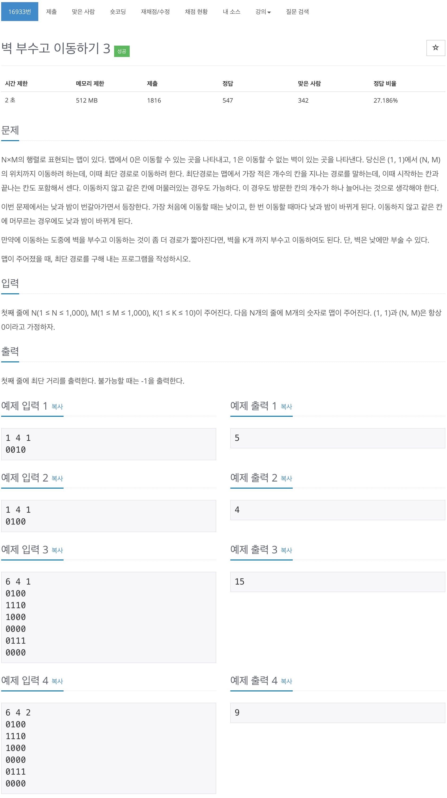
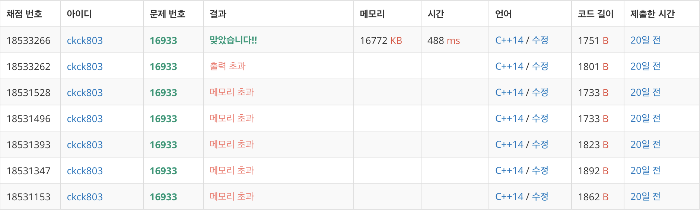

# 백준 16933 - 벽 부수고 이동하기 3



## 채점 현황



## 전체 소스 코드
```cpp
#include <iostream>
#include <queue>
using namespace std;

int dx[4] = {1, -1, 0, 0};
int dy[4] = {0, 0, 1, -1};
bool check[11][1000][1000];
int n, m, k;
int map[1001][1001];

struct Point {
    int k;
    int y;
    int x;
};

int main(void) {
    cin >> n >> m >> k;

    for (int i = 0; i < n; i++) {
        for (int j = 0; j < m; j++) {
            scanf("%1d", &map[i][j]);
        }
    }

    queue<Point> q;
    q.push({0, 0, 0});
    check[0][0][0] = true;

    int date = 1;
    int cntDay = true;
    while (!q.empty()) {
        int size = q.size();

        while (size--) {
            int cntK = q.front().k;
            int cntY = q.front().y;
            int cntX = q.front().x;
            q.pop();

            if (cntY == n - 1 && cntX == m - 1) {
                cout << date << '\n';
                return 0;
            }

            for (int i = 0; i < 4; i++) {
                int ny = cntY + dy[i];
                int nx = cntX + dx[i];

                if (0 <= ny && ny < n && 0 <= nx && nx < m) {
                    if (map[ny][nx] == 0 && check[cntK][ny][nx] == false) {
                        check[cntK][ny][nx] = true;
                        q.push({cntK, ny, nx});
                    }
                    if (map[ny][nx] == 1 && cntK < k && check[cntK + 1][ny][nx] == false) {
                        if (cntDay == true) {
                            check[cntK + 1][ny][nx] = true;
                            q.push({cntK + 1, ny, nx});

                        } else {
                            q.push({cntK, cntY, cntX});
                        }
                    }
                }
            }
        }
        date++;
        cntDay = !cntDay;
    }

    cout << -1 << '\n';
    return 0;
}
```