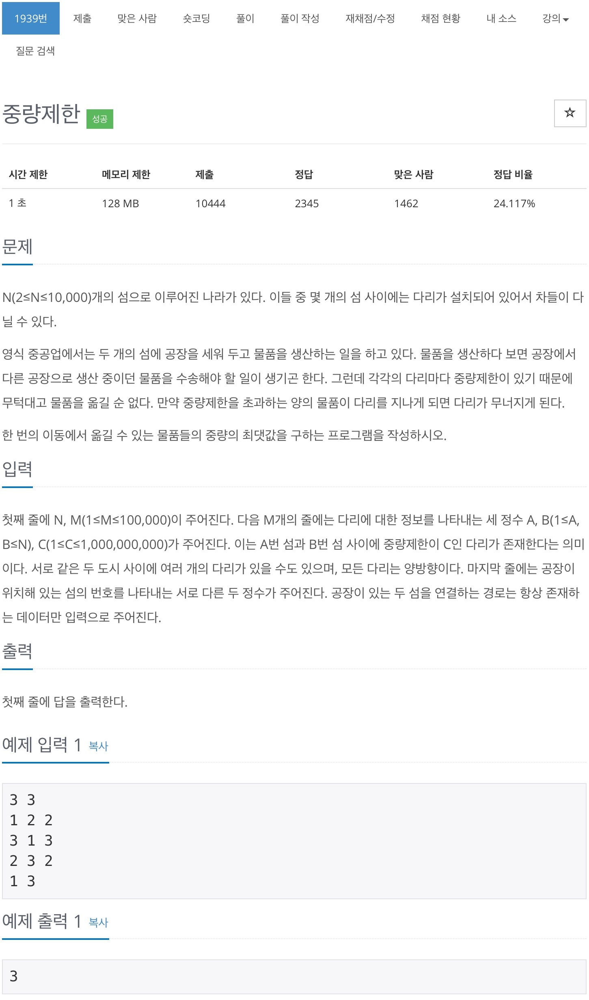
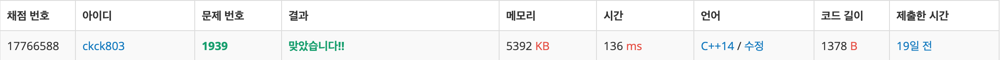

# 백준 1939 - 중량제한

## 문제



## 체점 결과


## 풀이 방법
이분 탐색 개념이 살짝 약해서 그런지 다시 풀었을 때 좀 많이 틀렸다.
이분 탐색에 대한 개념을 다시 공부해 볼 필요가 있을 것 같다.

문제에서 나타났 듯이 C의 범위는 10억 이하의 자연수 이고, 이 자연수 범위 내에서 `node1 -> node2`로 갈 수 있는 최대의 중량을 구하는 문제이다.

1. 10억 이하의 자연수 범위에서 최대의 중량은 어떻게 찾을 것이냐 => `이분탐색`을 이용해서
2. 조건을 만족하는 경로가 있는지 어떻게 확인 할 것이냐 => `BFS(mid)`를 이용해서
   1. `(weight>=mid)`조건을 만족하는 경로가 한개 이상 존재한다 : `true`
   2. `(cost>=mid)`조건을 만족하는 경로가 단 하나의 경로도 존재하지 않는다 : `false`

### 이분탐색

```cpp
int low = 0;
// high를 10억부터 시작하는게 아닌 다리가 버틸 수 있는
// 최대 중량부터 탐색을 시작하는게 탐색횟수를 줄일 수 있다.
int high = maxWeight;
while (low <= high) {
    int mid = (low + high) / 2;

    // wieght <= mid ?
    if (BFS(mid)) {
        low = mid + 1;
    } else {
        high = mid - 1;
    }
}
```
이분 탐색 조건식으로 `BFS`를 이용하였다.
`int high = maxWeight;`를 이용하여 탐색 범위를 10억 이하에서
최대 중량 이하로 바꾸면서 탐색 횟수를 줄였다.


### BFS
```cpp
bool BFS(int limit) {
    queue<int> q;
    vector<bool> check(N + 1, false);

    q.push(startPoint);
    check[startPoint] = true;

    while (!q.empty()) {
        int cnt = q.front();
        q.pop();

        if (cnt == endPoint) {
            return true;
        }

        for (int i = 0; i < map[cnt].size(); i++) {
            int next = map[cnt][i].first;
            int weight = map[cnt][i].second;

            if (weight >= limit && check[next] == false) {
                check[next] = true;
                q.push(next);
            }
        }
    }

    return false;
}
```
조건문으로 `BFS`를 이용한 것이라 `true` or `false`를 반환하도록 하였다. 

## 전체 소스 코드

```cpp
#include <iostream>
#include <queue>
#include <vector>
using namespace std;

int N, M;
vector<vector<pair<int, int>>> map;
int startPoint, endPoint;

bool BFS(int limit) {
    queue<int> q;
    vector<bool> check(N + 1, false);

    q.push(startPoint);
    check[startPoint] = true;

    while (!q.empty()) {
        int cnt = q.front();
        q.pop();

        if (cnt == endPoint) {
            return true;
        }

        for (int i = 0; i < map[cnt].size(); i++) {
            int next = map[cnt][i].first;
            int weight = map[cnt][i].second;

            if (weight >= limit && check[next] == false) {
                check[next] = true;
                q.push(next);
            }
        }
    }

    return false;
}

int main(void) {
    cin >> N >> M;
    map = vector<vector<pair<int, int>>>(N + 1);
    int maxWeight = 0;

    for (int i = 0; i < M; i++) {
        int a, b, c;
        cin >> a >> b >> c;

        if (c > maxWeight) {
            maxWeight = c;
        }

        map[a].push_back({b, c});
        map[b].push_back({a, c});
    }

    cin >> startPoint >> endPoint;

    int low = 0;
    int high = maxWeight;
    while (low <= high) {
        int mid = (low + high) / 2;

        // wieght <= mid ?
        if (BFS(mid)) {
            low = mid + 1;
        } else {
            high = mid - 1;
        }
    }

    cout << high << endl;
}
```