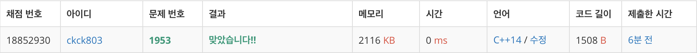

# 백준 1953 - 팀 배분


## 채점 현황


## 문제 풀이
전형 적인 `이분 그래프` 문제이다. N명의 사람들이 주어지고, N명의 사람마다 같은 그룹에 속하면 안되는 사람들의 번호가 나타난다. 각각의 연결 요소들을 받아들이고 `탐색`을 이용하여 `그래프 색칠하기`를 시작한다. 다만, 다음 값의 사람은 `현재값의 사람의 색깔`과 `다른 색`을 갖게끔 색칠하게 하면 된다.
## 팀 나누기
```cpp
void bfs(int n) {
    queue<int> q;
    q.push(n);
    check[n] = 1;
    num1++;

    while (!q.empty()) {
        int cnt = q.front();
        q.pop();

        for (int i = 0; i < graph[cnt].size(); i++) {
            int next = graph[cnt][i];

            if (check[next] == 0) {
                if (check[cnt] == 1) {
                    q.push(next);
                    num2++;
                    check[next] = 2;
                } else {
                    q.push(next);
                    num1++;
                    check[next] = 1;
                }
            }
        }
    }
}
```


## 전체 소스 코드
```cpp
#include <bits/stdc++.h>
using namespace std;

int n;
vector<vector<int>> graph;
int check[101];
int num1 = 0;
int num2 = 0;

void bfs(int n) {
    queue<int> q;
    q.push(n);
    check[n] = 1;
    num1++;

    while (!q.empty()) {
        int cnt = q.front();
        q.pop();

        for (int i = 0; i < graph[cnt].size(); i++) {
            int next = graph[cnt][i];

            if (check[next] == 0) {
                if (check[cnt] == 1) {
                    q.push(next);
                    num2++;
                    check[next] = 2;
                } else {
                    q.push(next);
                    num1++;
                    check[next] = 1;
                }
            }
        }
    }
}

int main(void) {
    cin.tie(0);
    cout.tie(0);
    ios_base::sync_with_stdio(false);
    cin >> n;
    graph = vector<vector<int>>(n + 1);

    for (int i = 1; i <= n; i++) {
        int num;
        cin >> num;
        for (int j = 0; j < num; j++) {
            int point;
            cin >> point;
            graph[i].push_back(point);
        }
    }

    for (int i = 1; i <= n; i++) {
        if (check[i] == 0) {
            bfs(i);
        }
    }

    cout << num1 << '\n';
    for (int i = 1; i <= n; i++) {
        if (check[i] == 1) {
            cout << i << ' ';
        }
    }
    cout << '\n';

    cout << num2 << '\n';
    for (int i = 1; i <= n; i++) {
        if (check[i] == 2) {
            cout << i << ' ';
        }
    }
    cout << '\n';
    return 0;
}
```