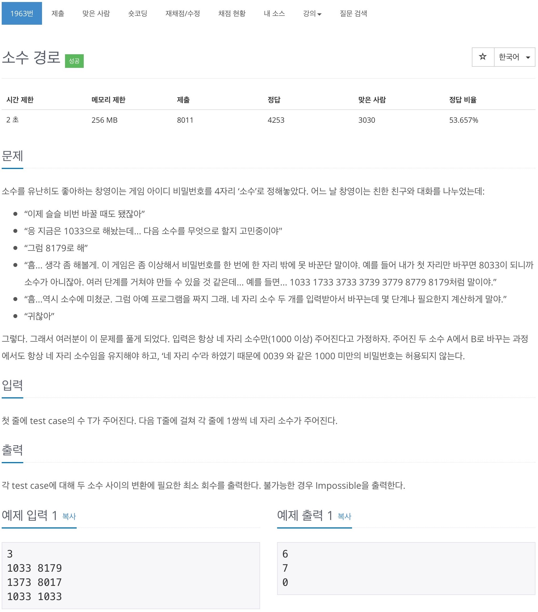

# 백준 1963 - 소수 경로



## 채점 현황


## 전체 소스 코드
```cpp
#include <iostream>
#include <queue>
#include <string>
using namespace std;

int T;
bool de[10001];
vector<string> v;

int main(void) {
    int T;
    cin >> T;

    for (int i = 2; i * i < 10000; i++) {
        for (int j = 2; j * i < 10000; j++) {
            de[i * j] = true;
        }
    }

    while (T--) {
        int start, end;
        cin >> start >> end;

        vector<bool> check(10000, false);
        queue<pair<int, int>> q;

        q.push({start, 0});
        check[start] = true;

        while (!q.empty()) {
            int cnt = q.front().first;
            int num = q.front().second;
            q.pop();

            if (cnt == end) {
                cout << num << '\n';
                break;
            }

            for (int i = 1; i <= 1000; i *= 10) {
                int r = cnt % (i * 10);
                r /= i;
                int value = cnt - (r * i);

                for (int j = 0; j < 10; j++) {
                    int temp = j * i;
                    int next = value + temp;

                    if (next > 1000 && de[next] == false && check[next] == false) {
                        check[next] = true;
                        q.push({next, num + 1});
                    }
                }
            }
        }
    }

    return 0;
}
```