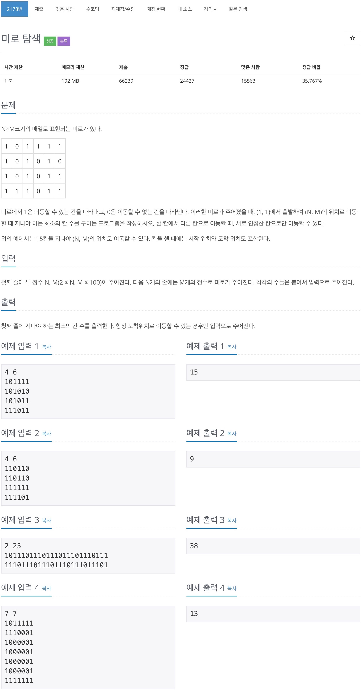

# 백준 2178 - 미로탐색



## cpp 코드
```cpp
#include <bits/stdc++.h>
using namespace std;

int Map[110][110];
bool check[110][110];

int dx[4] = {1, -1, 0, 0};
int dy[4] = {0, 0, 1, -1};

int main(void) {
    int n, m;
    scanf("%d %d", &n, &m);

    for (int i = 1; i <= n; i++) {
        for (int j = 1; j <= m; j++) {
            scanf("%1d", &Map[i][j]);
        }
    }

    int num = 0;
    queue<pair<int, int>> q;
    q.push({1, 1});
    check[1][1] = true;

    while (!q.empty()) {
        num++;
        int q_size = q.size();
        while (q_size--) {
            int cntY = q.front().first;
            int cntX = q.front().second;
            q.pop();

            if (cntY == n && cntX == m) {
                cout << num << '\n';
                return 0;
            }

            for (int i = 0; i < 4; i++) {
                int ny = cntY + dy[i];
                int nx = cntX + dx[i];

                if (Map[ny][nx] == 1 && check[ny][nx] == false) {
                    check[ny][nx] = true;
                    q.push({ny, nx});
                }
            }
        }
    }
    return 0;
}
```

## java 코드
```java
import java.io.BufferedReader;
import java.io.IOException;
import java.io.InputStreamReader;
import java.util.LinkedList;
import java.util.Queue;
import java.util.StringTokenizer;

public class Main {
    static int n, m;
    static int map[][];
    static boolean check[][];
    static int dx[] = { 1, -1, 0, 0 };
    static int dy[] = { 0, 0, 1, -1 };

    public static void main(String[] args) throws IOException {
        BufferedReader br = new BufferedReader(new InputStreamReader(System.in));
        StringTokenizer st = new StringTokenizer(br.readLine().trim());

        n = Integer.parseInt(st.nextToken());
        m = Integer.parseInt(st.nextToken());
        map = new int[n][m];
        check = new boolean[n][m];

        for (int i = 0; i < n; i++) {
            String row = br.readLine().trim();

            for (int j = 0; j < m; j++) {
                map[i][j] = row.charAt(j) - '0';
            }
        }

        // for (int i = 0; i < n; i++) {
        // for (int j = 0; j < m; j++) {
        // System.out.print(map[i][j]);
        // }
        // System.out.println();
        // }

        System.out.println(bfs(0, 0));

        br.close();
    }

    static class pair {
        int y;
        int x;

        public pair(int y, int x) {
            this.y = y;
            this.x = x;
        }
    }

    static int bfs(int y, int x) {
        Queue<pair> q = new LinkedList<>();
        q.offer(new pair(y, x));
        check[y][x] = true;
        int num = 0;

        while (!q.isEmpty()) {
            num++;
            int q_size = q.size();
            while (q_size-- != 0) {
                pair cnt = q.remove();

                if ((cnt.y == n - 1) && (cnt.x == m - 1)) {
                    return num;
                }

                for (int i = 0; i < 4; i++) {
                    int ny = cnt.y + dy[i];
                    int nx = cnt.x + dx[i];

                    if (0 <= ny && ny < n && 0 <= nx && nx < m) {
                        if (map[ny][nx] == 1 && check[ny][nx] == false) {
                            check[ny][nx] = true;
                            q.offer(new pair(ny, nx));
                        }
                    }
                }
            }
        }
        return num;
    }
}
```

## python 코드
```python
n, m = map(int, input().split())

matrix = [[0]*m for _ in range(n)]
check = [[False]*m for _ in range(n)]
dx = [1, -1, 0, 0]
dy = [0, 0, 1, -1]

for i in range(n):
    row = input()
    for j in range(m):
        matrix[i][j] = int(row[j])

queue = []
queue.append((0, 0))
check[0][0] = True
num = 0

while queue:
    num += 1
    q_size = len(queue)

    while(q_size):
        y, x = queue.pop(0)

        if y == n-1 and x == m-1:
            print(num)

        for i in range(4):
            ny = y + dy[i]
            nx = x + dx[i]

            if(0 <= ny < n and 0 <= nx < m):
                if(matrix[ny][nx] == 1 and check[ny][nx] == False):
                    check[ny][nx] = True
                    queue.append((ny, nx))

        q_size -= 1
```