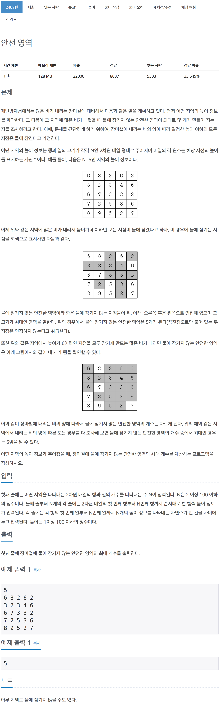

# 백준 2468 - 안전영역

[2468 - 안전영역](https://www.acmicpc.net/problem/2468)



```cpp
#include <iostream>
#include <queue>
using namespace std;

int dx[4] = {1, -1, 0, 0};
int dy[4] = {0, 0, 1, -1};

int n;

int arr[101][101];
int check[101][101];
int max_height;
int max_area = 1;
int area;

void bfs(int y, int x, int height)
{
    queue<pair<int, int>> q;
    q.push({y, x});

    while (!q.empty())
    {
        int y = q.front().first;
        int x = q.front().second;
        q.pop();

        for (int i = 0; i < 4; i++)
        {
            int ny = y + dy[i];
            int nx = x + dx[i];

            if (ny < 0 || ny >= n || nx < 0 || nx >= n)
                continue;
            if (arr[ny][nx] <= height || check[ny][nx] != 0)
                continue;

            check[ny][nx] = 1;
            q.push({ny, nx});
        }
    }
}

int main(void)
{
    cin >> n;

    for (int i = 0; i < n; i++)
        for (int j = 0; j < n; j++)
        {
            cin >> arr[i][j];
            if (max_height < arr[i][j])
                max_height = arr[i][j];
        }

    for (int h = 1; h <= 100; h++)
    {
        area = 0;
        for (int i = 0; i < n; i++)
            for (int j = 0; j < n; j++)
                check[i][j] = 0;

        for (int i = 0; i < n; i++)
        {
            for (int j = 0; j < n; j++)
            {
                if (arr[i][j] > h && check[i][j] == 0)
                {
                    bfs(i, j, h);
                    area++;
                }
            }
        }

        if (max_area < area)
            max_area = area;
    }

    cout << max_area << '\n';
    return 0;
}
```
