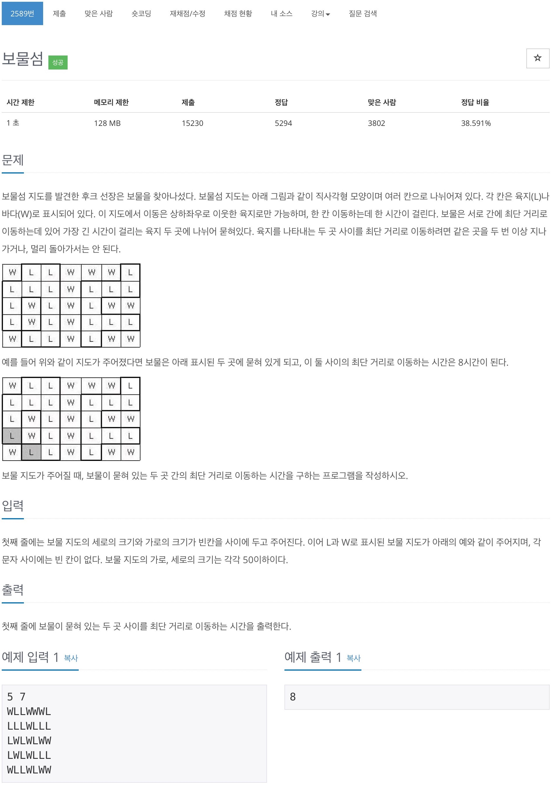

# 백준 2589 - 보물섬


## 채점 현황


## 전체 소스 코드
```cpp
#include <iostream>
#include <queue>
using namespace std;

int r, l;
char arr[51][51];
int maxLevel = 0;
int dx[4] = {1, 0, -1, 0};
int dy[4] = {0, 1, 0, -1};
struct point {
    int y;
    int x;
    int level;
};

void explore(int y, int x) {
    queue<point> q;
    vector<vector<bool>> check(r, vector<bool>(l, false));
    check[y][x] = true;
    q.push({y, x, 0});

    while (!q.empty()) {
        int cy = q.front().y;
        int cx = q.front().x;
        int clevel = q.front().level;
        q.pop();

        if (maxLevel < clevel) {
            maxLevel = clevel;
        }

        for (int i = 0; i < 4; i++) {
            int ny = cy + dy[i];
            int nx = cx + dx[i];

            if (0 <= ny && ny < r && 0 <= nx && nx < l) {
                if (check[ny][nx] == false && arr[ny][nx] == 'L') {
                    check[ny][nx] = true;
                    q.push({ny, nx, clevel + 1});
                }
            }
        }
    }
}

int main(void) {
    cin >> r >> l;

    for (int i = 0; i < r; i++) {
        for (int j = 0; j < l; j++) {
            cin >> arr[i][j];
        }
    }

    for (int i = 0; i < r; i++) {
        for (int j = 0; j < l; j++) {
            if (arr[i][j] == 'L') {
                explore(i, j);
            }
        }
    }

    cout << maxLevel << endl;

    return 0;
}
```