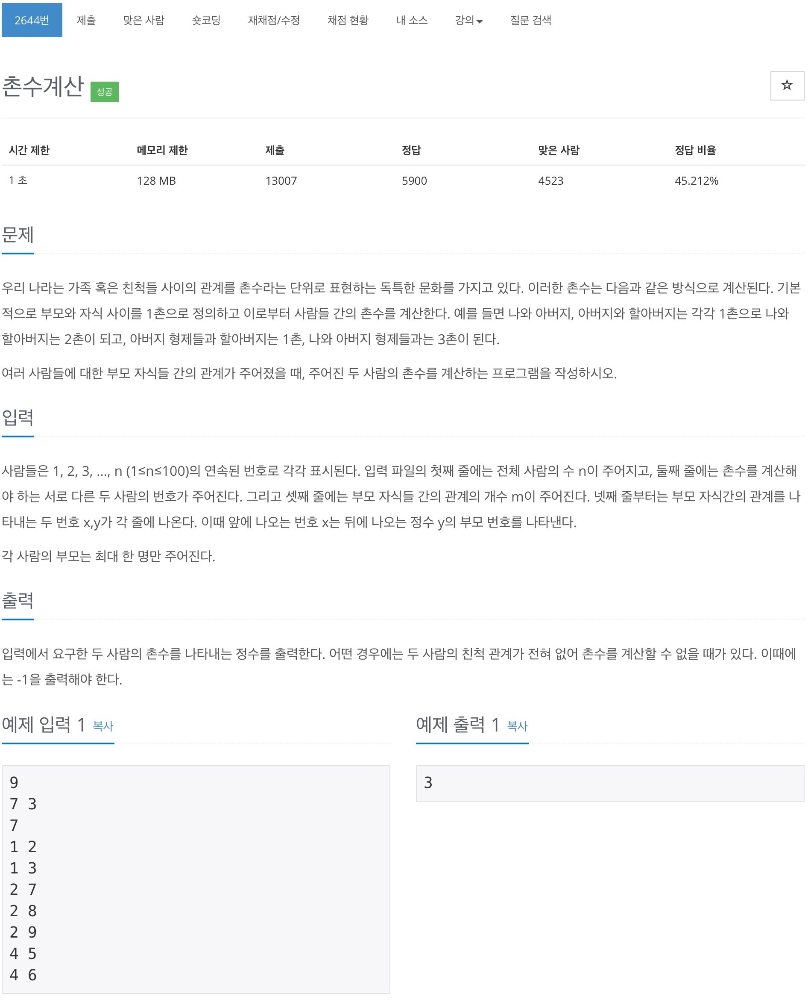
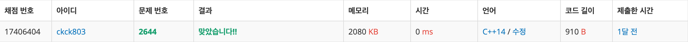

# 백준 2644 - 촌수 계산



## 채점 현황



## 전체 소스 코드
```cpp
#include <iostream>
#include <queue>
using namespace std;

int n;
int start, e;
int m;
int arr[110][110];
int check[110][110];

int main(void) {
    cin >> n >> start >> e >> m;

    for (int i = 0; i < m; i++) {
        int x, y;
        cin >> x >> y;

        arr[x][y] = 1;
        arr[y][x] = 1;
    }

    queue<pair<int, int>> q;
    q.push({start, 0});

    bool isTrue = false;
    while (!q.empty()) {
        int cnt = q.front().first;
        int value = q.front().second;
        q.pop();

        if (cnt == e) {
            isTrue = true;
            cout << value << '\n';
            break;
        }

        for (int i = 1; i <= n; i++) {
            if (arr[cnt][i] == 1 && check[cnt][i] == false) {
                check[cnt][i] = true;
                q.push({i, value + 1});
            }
        }
    }

    if (isTrue == false) {
        cout << -1 << '\n';
    }

    return 0;
}
```