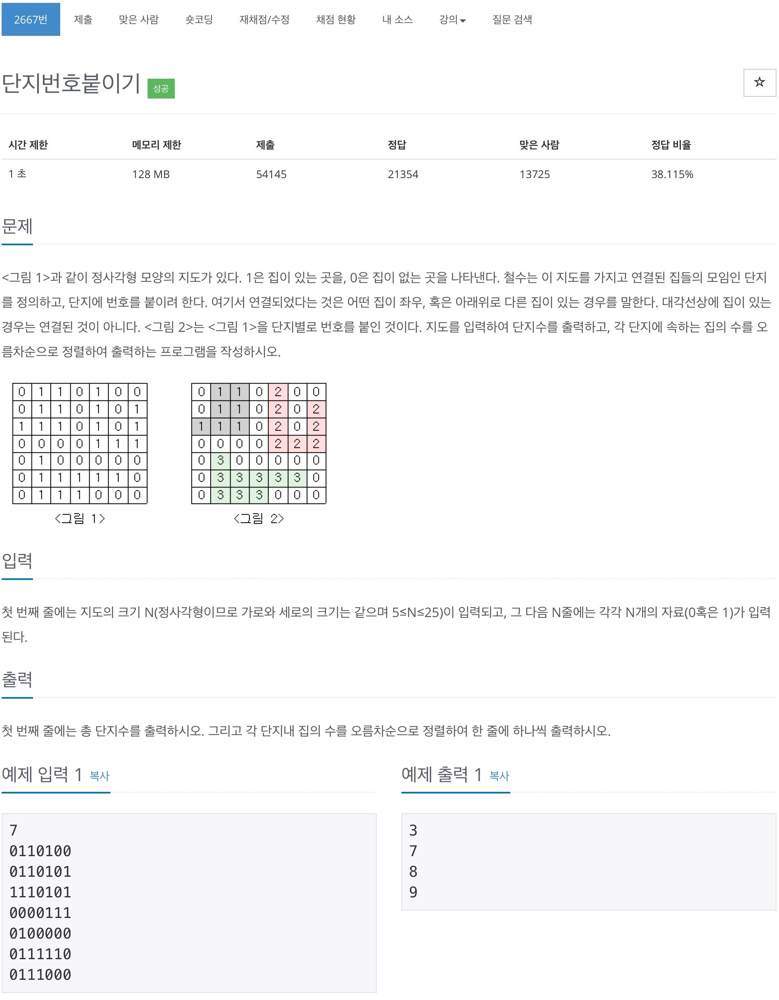

# 백준 2667 - 단지번호 붙이기



## 채점 현황


## 전체 소스 코드
```cpp
for (int i = 0; i < n; i++) {
    for (int j = 0; j < n; j++) {
        if (check[i][j] == false && arr[i][j] == 1) {
            check[i][j] = true;
            location.push(make_pair(i, j));
            num++;

            // 해당 단지의 집의 개수
            int h_num = 1;
            while (!location.empty()) {
                pair<int, int> temp = location.front();
                location.pop();

                int y = temp.first;
                int x = temp.second;

                for (int a = 0; a < 4; a++) {
                    int next_y = y + dy[a];
                    int next_x = x + dx[a];
                    if (0 <= next_y && next_y < n && 0 <= next_x && next_x < n && arr[next_y][next_x] == 1 && check[next_y][next_x] == false) {
                        check[next_y][next_x] = true;
                        h_num++;
                        location.push(make_pair(next_y, next_x));
                    }
                }
            }
            house_num.push_back(h_num);
        }
    }
}
```

```cpp
#include <algorithm>
#include <iostream>
#include <queue>
#include <string>
#include <vector>
using namespace std;

int arr[30][30];
int check[30][30];
int n;
int num;
queue<pair<int, int>> location;
int dx[4] = {1, -1, 0, 0};
int dy[4] = {0, 0, 1, -1};

vector<int> house_num;

int main(void) {
    scanf("%d", &n);

    for (int i = 0; i < n; i++) {
        for (int j = 0; j < n; j++) {
            scanf("%1d", &arr[i][j]);
        }
    }

    for (int i = 0; i < n; i++) {
        for (int j = 0; j < n; j++) {
            if (check[i][j] == false && arr[i][j] == 1) {
                check[i][j] = true;
                location.push(make_pair(i, j));
                num++;

                // 해당 단지의 집의 개수
                int h_num = 1;
                while (!location.empty()) {
                    pair<int, int> temp = location.front();
                    location.pop();

                    int y = temp.first;
                    int x = temp.second;

                    for (int a = 0; a < 4; a++) {
                        int next_y = y + dy[a];
                        int next_x = x + dx[a];
                        if (0 <= next_y && next_y < n && 0 <= next_x && next_x < n && arr[next_y][next_x] == 1 && check[next_y][next_x] == false) {
                            check[next_y][next_x] = true;
                            h_num++;
                            location.push(make_pair(next_y, next_x));
                        }
                    }
                }
                house_num.push_back(h_num);
            }
        }
    }
    sort(house_num.begin(), house_num.end());
    int v_size = house_num.size();

    printf("%d\n", num);
    for (int i = 0; i < v_size; i++) {
        printf("%d\n", house_num[i]);
    }
    return 0;
}
```
