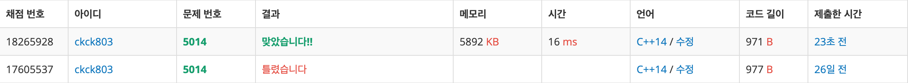
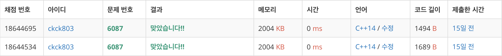

# BFS
| 문제              | 이름              | 링크                                    | 정리여부  |       비고        |
| --------------- | --------------- | ------------------------------------- | :---: | :-------------: |
| [1012](1012/)   | 유기농 배추          | https://www.acmicpc.net/problem/1012  |       |                 |
| [1600](1600/)   | 말이 되고픈 원숭이      | https://www.acmicpc.net/problem/1600  |       |                 |
| [1707](1707/)   | 이분 그래프          | https://www.acmicpc.net/problem/1707  |       |                 |
| [1726](1726/)   | 로봇              | https://www.acmicpc.net/problem/1726  |       |                 |
| [1939](1939/)   | 중량제한            | https://www.acmicpc.net/problem/1939  |       |                 |
| [1953](1953/)   | 팀 배분            | https://www.acmicpc.net/problem/1953  |   O   |     이분 그래프      |
| [1963](1963/)   | 소수 경로           | https://www.acmicpc.net/problem/1963  |
| [1967](1967/)   | 트리의 지름          | https://www.acmicpc.net/problem/1967  |
| [2146](2146/)   | 다리 만들기          | https://www.acmicpc.net/problem/2146  |
| [2206](2206/)   | 벽 부수고 이동하기      | https://www.acmicpc.net/problem/2206  |
| [2251](2251/)   | 물통              | https://www.acmicpc.net/problem/2251  |
| [2234](2234/)   | 성곽              | https://www.acmicpc.net/problem/2234  |       |                 |
| [2468](2468/)   | 안전 영역           | https://www.acmicpc.net/problem/2468  |
| [2573](2573/)   | 빙산              | https://www.acmicpc.net/problem/2573  |
| [2583](2583/)   | 영역 구하기          | https://www.acmicpc.net/problem/2583  |
| [2589](2589/)   | 보물섬             | https://www.acmicpc.net/problem/2589  |
| [2606](2606/)   | 바이러스            | https://www.acmicpc.net/problem/2606  |
| [2644](2644/)   | 촌수 계산           | https://www.acmicpc.net/problem/2644  |
| [2667](2667/)   | 단지번호 붙이기        | https://www.acmicpc.net/problem/2667  |
| [2933](2933/)   | 미네랄             | https://www.acmicpc.net/problem/2933  |
| [5014](5014/)   | 스타트와 링크         | https://www.acmicpc.net/problem/5014  |
| [5213](5213/)   | 과외맨             | https://www.acmicpc.net/problem/5213  |
| [5427](5427/)   | 불               | https://www.acmicpc.net/problem/5427  |
| [6087](6087/)   | 레이저 통신          | https://www.acmicpc.net/problem/6087  |
| [6593](6593/)   | 상범 빌딩           | https://www.acmicpc.net/problem/6593  |
| [7576](7576/)   | 토마토             | https://www.acmicpc.net/problem/7576  |
| [9019](9019/)   | DSLR            | https://www.acmicpc.net/problem/9019  |
| [9205](9205/)   | 맥주 마시면서 걸어가기    | https://www.acmicpc.net/problem/9205  |
| [9372](9372/)   | 상근이의 여행         | https://www.acmicpc.net/problem/9372  |
| [12886](12886/) | 돌 그룹            | https://www.acmicpc.net/problem/12886 |
| [16236](16236/) | 아기 상어           | https://www.acmicpc.net/problem/16236 |   O   | `bfs`를 통해 거리구하기 |
| [16397](16397/) | 탈출              | https://www.acmicpc.net/problem/16397 |
| [16933](16933/) | 벽 부수고 이동하기3     | https://www.acmicpc.net/problem/16933 |       |                 |
| [17471](17471/) | 게리맨더링           | https://www.acmicpc.net/problem/17471 |   O   |   조합, bfs, 삼성   |
| [17836](17836/) | 공주님을 구해라        | https://www.acmicpc.net/problem/17836 |
| [18809](18809/) | Gaaaaaaaaaarden | https://www.acmicpc.net/problem/18809 |       |   조합, bfs, 삼성   |

## 채점 현황

### [1012](1012/) - 유기농 배추  

### [1600](1600/) - 말이 되고픈 원숭이  

### [1707](1707/) - 이분 그래프  

### [1726](1726/) - 로봇  

### [1939](1939/) - 중량제한  

### [1963](1963/) - 소수 경로  

### [1967](1967/) - 트리의 지름  

### [2146](2146/) - 다리 만들기  

### [2206](2206/) - 벽 부수고 이동하기  

### [2251](2251/) - 물통  

### [2468](2468/) - 안전 영역  

### [2573](2573/) - 빙산  

### [2583](2583/) - 영역 구하기  

### [2589](2589/) - 보물섬  

### [2606](2606/) - 바이러스  

### [2644](2644/) - 촌수 계산  

### [2667](2667/) - 단지번호 붙이기  

### [2933](2933/) - 미네랄  

### [5014](5014/) - 스타트와 링크  

### [5213](5213/) - 과외맨  

### [5427](5427/) - 불  

### [6087](6087/) - 레이저 통신
 

### [6593](6593/) - 상범 빌딩  

### [7576](7576/) - 토마토  

### [9019](9019/) - DSLR  

### [9205](9205/) - 맥주 마시면서 걸어가기  

### [9372](9372/) - 상근이의 여행  

### [12886](12886/) - 돌 그룹  

### [16236](16236/) - 아기 상어  

### [16397](16397/) - 탈출  

### [16933](16933/) - 벽 부수고 이동하기3

### [17471](17471/) - 게리맨더링  

### [17836](17836/) - 공주님을 구해라  

### [18809](18809/) - Gaaaaaaaaaarden

