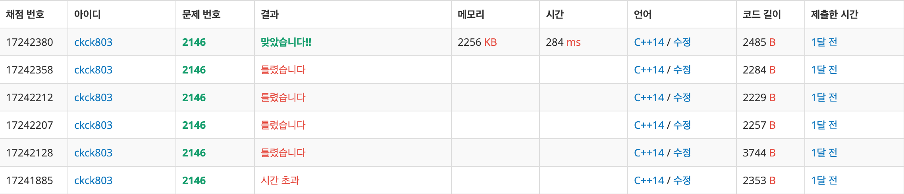
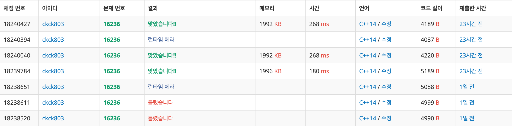

# BFS

### 1. [1012](1012/) - 유기농 배추 &nbsp;&nbsp; (https://www.acmicpc.net/problem/1012)

### 2. [1600](1600/) - 말이 되고픈 원숭이 &nbsp;&nbsp; (https://www.acmicpc.net/problem/1600)

### 3. [1707](1707/) - 이분 그래프 &nbsp;&nbsp; (https://www.acmicpc.net/problem/1707)

### 4. [1726](1726/) - 로봇 &nbsp;&nbsp; (https://www.acmicpc.net/problem/1726)

### 5. [1939](1939/) - 중량제한 &nbsp;&nbsp; (https://www.acmicpc.net/problem/1939)

### 6. [1963](1963/) - 소수 경로 &nbsp;&nbsp; (https://www.acmicpc.net/problem/1963)

### 7. [1967](1967/) - 트리의 지름 &nbsp;&nbsp; (https://www.acmicpc.net/problem/1967)

### 8. [2146](2146/) - 다리 만들기 &nbsp;&nbsp; (https://www.acmicpc.net/problem/2146)

### 9. [2206](2206/) - 벽 부수고 이동하기 &nbsp;&nbsp; (https://www.acmicpc.net/problem/2206)

### 10. [2251](2251/) - 물통 &nbsp;&nbsp; (https://www.acmicpc.net/problem/2251)

### 11. [2468](2468/) - 안전 영역 &nbsp;&nbsp; (https://www.acmicpc.net/problem/2468)

### 12. [2573](2573/) - 빙산 &nbsp;&nbsp; (https://www.acmicpc.net/problem/2573)

### 13. [2583](2583/) - 영역 구하기 &nbsp;&nbsp; (https://www.acmicpc.net/problem/2583)

### 14. [2589](2589/) - 보물섬 &nbsp;&nbsp; (https://www.acmicpc.net/problem/2589)

### 15. [2606](2606/) - 바이러스 &nbsp;&nbsp; (https://www.acmicpc.net/problem/2606)

### 16. [2644](2644/) - 촌수 계산 &nbsp;&nbsp; (https://www.acmicpc.net/problem/2644)

### 17. [2667](2667/) - 단지번호 붙이기 &nbsp;&nbsp; (https://www.acmicpc.net/problem/2667)

### 18. [2933](2933/) - 미네랄 &nbsp;&nbsp; (https://www.acmicpc.net/problem/2933)

### 19. [5014](5014/) - 스타트와 링크 &nbsp;&nbsp; (https://www.acmicpc.net/problem/5014)

### 20. [5213](5213/) - 과외맨 &nbsp;&nbsp; (https://www.acmicpc.net/problem/5213)

### 21. [5427](5427/) - 불 &nbsp;&nbsp; (https://www.acmicpc.net/problem/5427)

### 22. [7576](7576/) - 토마토 &nbsp;&nbsp; (https://www.acmicpc.net/problem/7576)

### 23. [9019](9019/) - DSLR &nbsp;&nbsp; (https://www.acmicpc.net/problem/9019)

### 24. [9205](9205/) - 맥주 마시면서 걸어가기 &nbsp;&nbsp; (https://www.acmicpc.net/problem/9205)

### 25. [9372](9372/) - 상근이의 여행 &nbsp;&nbsp; (https://www.acmicpc.net/problem/9372)

### 26. [12886](12886/) - 돌 그룹 &nbsp;&nbsp; (https://www.acmicpc.net/problem/12886)

### 27. [15653](15653/) - 구슬 탈출4 &nbsp;&nbsp; (https://www.acmicpc.net/problem/15653)

### 28. [16236](16236/) - 아기 상어 &nbsp;&nbsp; (https://www.acmicpc.net/problem/16236)

### 29. [16397](16397/) - 탈출 &nbsp;&nbsp; (https://www.acmicpc.net/problem/16397)

### 30. [17836](17836/) - 공주님을 구해라 &nbsp;&nbsp; (https://www.acmicpc.net/problem/17836)

