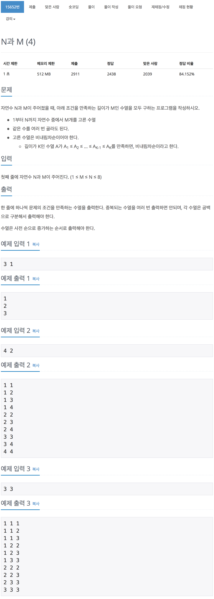

# 백준 15652 - N과 M(4)

[15652 - N과 M(4)](https://www.acmicpc.net/problem/15652)



```cpp
#include <iostream>
using namespace std;

const int MAX = 8 + 1;
int N, M;
int arr[MAX];

void dfs(int cnt, int depth)
{
    if (depth == M)
    {
        for (int i = 0; i < M; i++)
            cout << arr[i] << " ";
        cout << "\n";
        return;
    }
    for (int i = cnt; i <= N; i++)
    {
        arr[depth] = i;
        dfs(i, depth + 1);
    }
}

int main(void)
{
    cin >> N >> M;
    dfs(1, 0);
    return 0;
}
```
