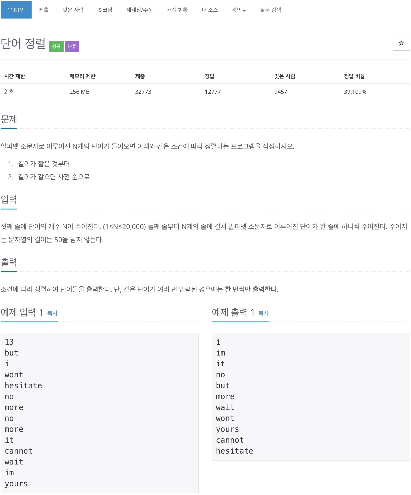

# 백준 1181 - 단어 정렬



## cpp 코드
```cpp
#include <bits/stdc++.h>
using namespace std;

set<pair<int, string>> s;
int n;

int main(void) {
    cin.tie(0);
    cout.tie(0);
    ios_base::sync_with_stdio(false);
    cin >> n;
    while (n--) {
        string word;
        cin >> word;
        s.insert({word.length(), word});
    }

    for (auto iter = s.begin(); iter != s.end(); iter++) {
        cout << iter->second << '\n';
    }

    return 0;
}
```

## 파이썬 코드
```python
n = int(input())

s = set()

for i in range(n):
    s.add(input())

s = sorted(sorted(s), key=len)
for a in s:
    print(a)
```