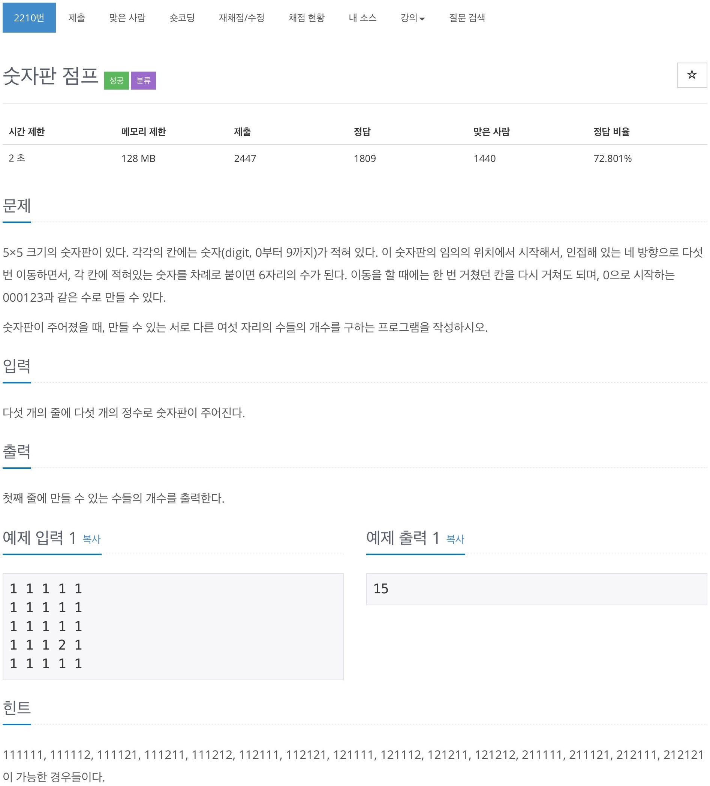

# 백준 2210 - 숫자판 점프



## cpp 코드
```cpp
#include <bits/stdc++.h>
using namespace std;

char field[5][5];
char str[6];
set<string> s;
int dx[4] = {1, -1, 0, 0};
int dy[4] = {0, 0, 1, -1};

void dfs(int y, int x, int depth) {
    if (depth == 6) {
        s.insert(str);
        return;
    }

    for (int i = 0; i < 4; i++) {
        int ny = y + dy[i];
        int nx = x + dx[i];

        if (0 > ny || ny >= 5 || 0 > nx || nx >= 5)
            continue;
        str[depth] = field[ny][nx];
        dfs(ny, nx, depth + 1);
    }
}

int main(void) {
    for (int i = 0; i < 5; i++) {
        for (int j = 0; j < 5; j++) {
            cin >> field[i][j];
        }
    }
    for (int i = 0; i < 5; i++) {
        for (int j = 0; j < 5; j++) {
            str[0] = field[i][j];
            dfs(i, j, 1);
        }
    }
    cout << s.size() << '\n';
    return 0;
}
```

## 파이썬 코드
```python
map = [['0']*5 for _ in range(5)]
dx = [1, -1, 0, 0]
dy = [0, 0, 1, -1]

s = set()


def dfs(y, x, depth, str):
    if(depth == 6):
        global s
        s.add(str)
        return

    for i in range(4):
        ny = y + dy[i]
        nx = x + dx[i]

        if(0 > ny or ny >= 5 or 0 > nx or nx >= 5):
            continue
        dfs(ny, nx, depth+1, str + map[ny][nx])


for i in range(5):
    map[i] = input().split()

for i in range(5):
    for j in range(5):
        dfs(i, j, 1, map[i][j])

print(len(s))
```