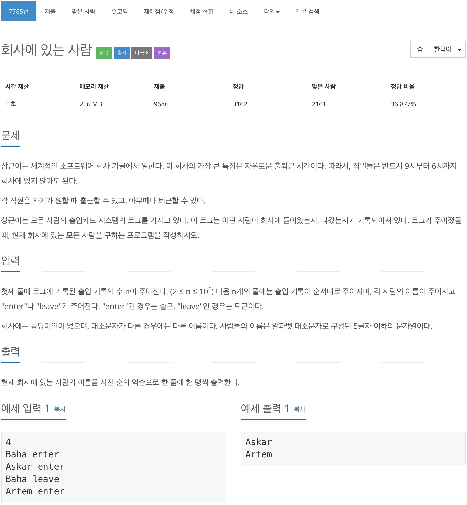

# 백준 7785 - 회사에 있는 사람



## 전체 소스 코드
```cpp
#include <bits/stdc++.h>
using namespace std;

int n;

int main(void) {
    cin >> n;
    set<string> s;

    while (n--) {
        string name, command;
        cin >> name >> command;

        if (command == "enter") {
            s.insert(name);
        } else {
            s.erase(s.find(name));
        }
    }

    stack<string> st;
    for (set<string>::iterator iter = s.begin(); iter != s.end(); iter++) {
        st.push(*iter);
    }
    while (!st.empty()) {
        cout << st.top() << '\n';
        st.pop();
    }
    return 0;
}
```