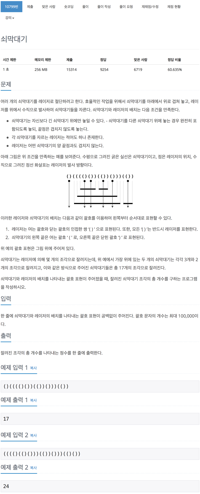

# 백준 10799 - 쇠막대기

[10799](https://www.acmicpc.net/problem/10799)



```cpp
#include <iostream>
#include <string>
using namespace std;

string s;
int stick_num;
int total_num;

int main(void)
{
    cin >> s;
    int s_size = s.length();

    for (int i = 0; i < s_size; i++)
    {
        if (s[i] == '(')
        {
            if (s[i + 1] == ')')
            {
                total_num += stick_num;
                i++;
            }
            else
            {
                stick_num++;
            }
        }
        else
        {
            total_num++;
            stick_num--;
        }
    }

    cout << total_num << '\n';
}
```
