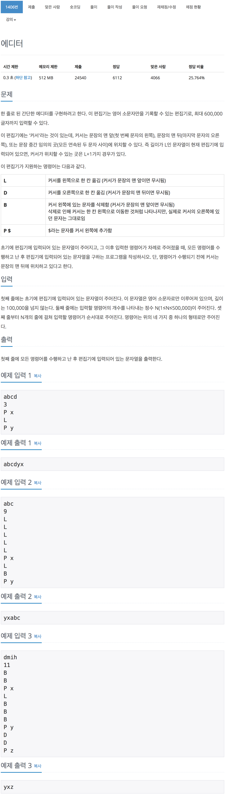

# 백준 1406 - 에디터

[1406 - 에디터](https://www.acmicpc.net/problem/1406)



```cpp
while (n--)
{
    char order;
    cin >> order;

    if (order == 'L')
    {
        if (!st_left.empty())
        {
            st_right.push(st_left.top());
            st_left.pop();
        }
    }
    else if (order == 'D')
    {
        if (!st_right.empty())
        {
            st_left.push(st_right.top());
            st_right.pop();
        }
    }
    else if (order == 'B')
    {
        if (!st_left.empty())
        {
            st_left.pop();
        }
    }
    else
    {
        char c;
        cin >> c;
        st_left.push(c);
    }
}
```

```cpp
#include <iostream>
#include <stack>
using namespace std;

stack<char> st_left;
stack<char> st_right;
int n;
string s;

int main(void)
{
    cin >> s >> n;

    int s_size = s.length();
    for (int i = 0; i < s_size; i++)
    {
        st_left.push(s[i]);
    }

    while (n--)
    {
        char order;
        cin >> order;

        if (order == 'L')
        {
            if (!st_left.empty())
            {
                st_right.push(st_left.top());
                st_left.pop();
            }
        }
        else if (order == 'D')
        {
            if (!st_right.empty())
            {
                st_left.push(st_right.top());
                st_right.pop();
            }
        }
        else if (order == 'B')
        {
            if (!st_left.empty())
            {
                st_left.pop();
            }
        }
        else
        {
            char c;
            cin >> c;
            st_left.push(c);
        }
    }
    int stack_size = st_left.size();
    for (int i = 0; i < stack_size; i++)
    {
        st_right.push(st_left.top());
        st_left.pop();
    }

    stack_size = st_right.size();
    for (int i = 0; i < stack_size; i++)
    {
        cout << st_right.top();
        st_right.pop();
    }
    return 0;
}
```
