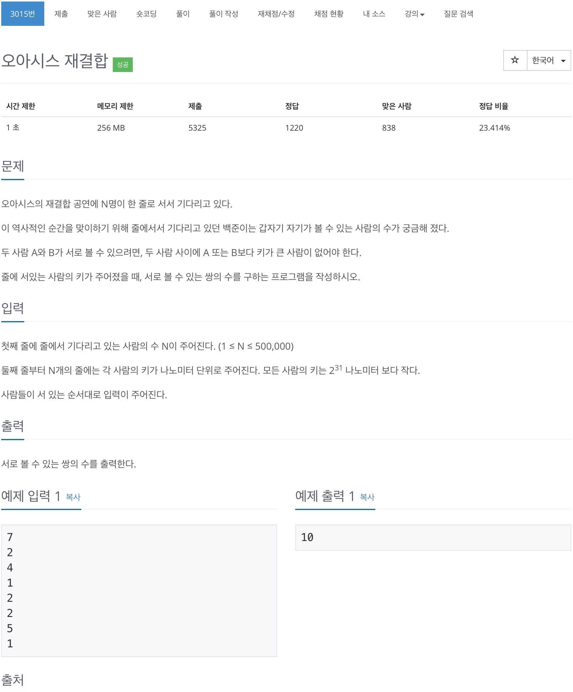
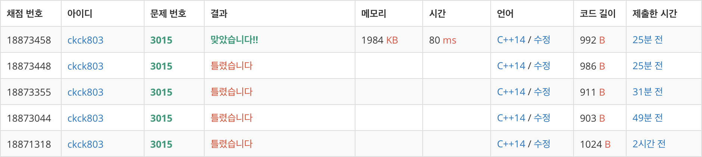
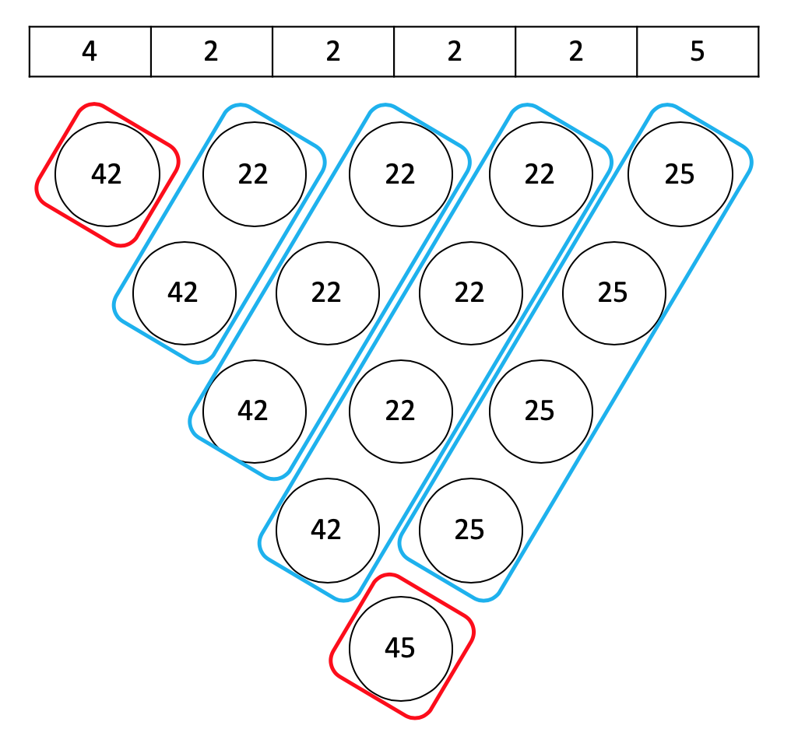

# 백준 3015 - 오아시스 재결합



## 채점 현황


## 틀린 이유
### 처음 틀린 이유
```cpp
if (st.top().first == value) {
    pair<int, int> cntValue = st.top();
    st.pop();

    cntValue.second++;

    num += cntValue.second;
    st.push(cntValue);
}
```
이렇게 조건을 짜게 되면 2, 2, 2처럼 처음에 연속된 값이 들어올 경우 틀린 정답을 내게 된다.
처음에 연속된 수가 들어올 경우에 대해 생각하지 못해서 틀렸다.

### 두번째 틀린 이유
```cpp
int num;
```
최악의 경우의 수를 생각하지 못했다. 사람의 수가 `50만` 이니깐, 최악의 경우 `51만 * 25만`이므로 int의 범위를 넘어가게 된다.


## 문제 풀이
이 문제의 관건은 같은 수가 들어 왔을 때 어떻게 처리 할 것이냐가 중요하다.
밑의 그림이 같은 값이 들어왔을때 생기는 경우의 수를 그림으로 나타낸 방법이다.



일단 같은 값의 갯수를 저장할 필요가 있다. 그리고 같은 값이 들어오게 되면 가중치를 더해가는 방식으로 문제를 해결하면 된다. 

1. 스택에 값이 없으면 읽은 값을 넣어준다.
2. 스택에 값이 있을 경우 `top`값과 비교해 같은 값이 아니면 `num`값을 증가시켜주고 넣는다.
3. 같은 값일 경우 `top`값의 갯수를 늘려준다. 이때에는 `+1`로 값을 증가시켜주는 방식이 아닌 해당 값의 갯수를 더해주는 방식으로 `num`을 증가시켜주어야 한다.
4. `top`의 값보다 `value`가 크다면 스택에서 `value`보다 큰 값이 나올때까지 `pop`한다. 이때, `top`값이 가지고 있는 갯수를 더준다.(pop하는 값의 갯수 = value와 결합하는 경우의 수)

## 같은 값이 들어왔을 때 처리하기 위한 코드
```cpp
if (st.top().first == value) {
    pair<int, int> cntValue = st.top();
    st.pop();

    num += cntValue.second;
    if (!st.empty()) {
        num++;
    }

    cntValue.second++;
    st.push(cntValue);
}
```
일단 현재 값의 갯수를 더해주고 이 값이 처음 값이 아닌지 확인 한 후 아니라면 `+1`을 해준다.

## 큰 값이 들어왔을 때 처리하기 위한 코드
```cpp
while (!st.empty() && st.top().first < value) {
    pair<int, int> cntValue = st.top();
    st.pop();

    num += cntValue.second;
}
```
해당 값보다 큰 값이 나올 때까지 스택을 계속 `pop`해준다. 이 때 `pop한 값의 갯수`를 계속해서 더해 가야 한다.(들어오는 값`value`과 만들 수 있는 결합의 경우의 수)


## 전체 소스 코드
```cpp
#include <bits/stdc++.h>
using namespace std;

int N;
stack<pair<int, int>> st;
long long num;
int bottomValue;

int main(void) {
    cin.tie(0);
    cout.tie(0);
    ios_base::sync_with_stdio(false);
    cin >> N;

    while (N--) {
        int value;
        cin >> value;

        while (!st.empty() && st.top().first < value) {
            pair<int, int> cntValue = st.top();
            st.pop();

            num += cntValue.second;
        }

        if (st.empty()) {
            st.push({value, 1});
        } else {
            if (st.top().first == value) {
                pair<int, int> cntValue = st.top();
                st.pop();

                num += cntValue.second;
                if (!st.empty()) {
                    num++;
                }

                cntValue.second++;
                st.push(cntValue);
            } else {
                num++;
                st.push({value, 1});
            }
        }
    }

    cout << num << '\n';
    return 0;
}
```