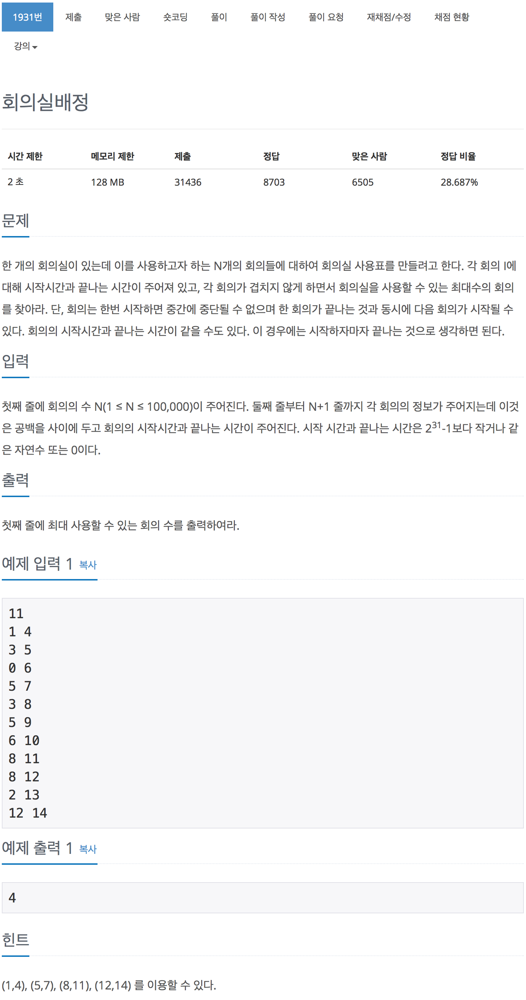

# 백준 1931 - 회의실 배정

[1931 - 회의실 배정](https://www.acmicpc.net/problem/1931)



```cpp
#include <iostream>
#include <vector>
#include <algorithm>
using namespace std;

struct Time
{
    int begin;
    int end;
};

bool cmp(Time f, Time s)
{
    if (f.end == s.end)
        return f.begin < s.begin;
    else
        return f.end < s.end;
}

int main(void)
{
    int n;
    cin >> n;

    vector<Time> t(n);
    for (int i = 0; i < n; i++)
    {
        cin >> t[i].begin >> t[i].end;
    }

    sort(t.begin(), t.end(), cmp);

    int cnt = 0;
    int end_time = 0;

    // for (int i = 0; i < t.size(); i++)
    // {
    //     cout << t[i].begin << " " << t[i].end << endl;
    // }

    for (int i = 0; i < t.size(); i++)
    {
        if (end_time <= t[i].begin)
        {
            end_time = t[i].end;
            cnt++;
        }
    }

    cout << cnt << endl;
}
```
