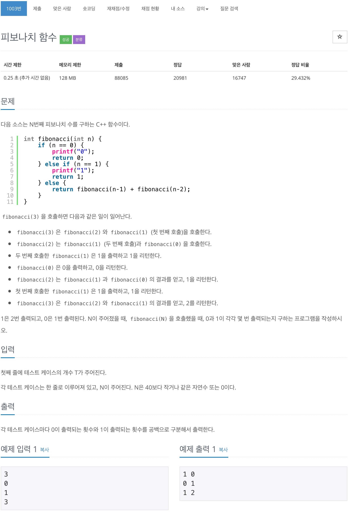

# 백준 1003 - 피보나치 함수

(https://www.acmicpc.net/problem/1003)


## 전체 소스 코드
```cpp
#include <iostream>
#include <vector>
using namespace std;

vector<long long> v(41);
pair<int, int> num[41];

int T;

int fibonacci(int n) {
    if (v[n] != 0) {
        return v[n];
    }

    if (n == 0) {
        return 0;
    } else if (n == 1) {
        return 1;
    }

    v[n] = fibonacci(n - 1) + fibonacci(n - 2);
    num[n].first = num[n - 1].first + num[n - 2].first;
    num[n].second = num[n - 1].second + num[n - 2].second;
    return v[n];
}

int main(void) {
    cin >> T;

    while (T--) {
        for (int i = 0; i <= 40; i++) {
            num[i] = {0, 0};
            v[i] = 0;
        }
        num[0] = {1, 0};
        num[1] = {0, 1};

        int n;
        cin >> n;
        fibonacci(n);

        cout << num[n].first << " " << num[n].second << '\n';
    }

    return 0;
}
```
