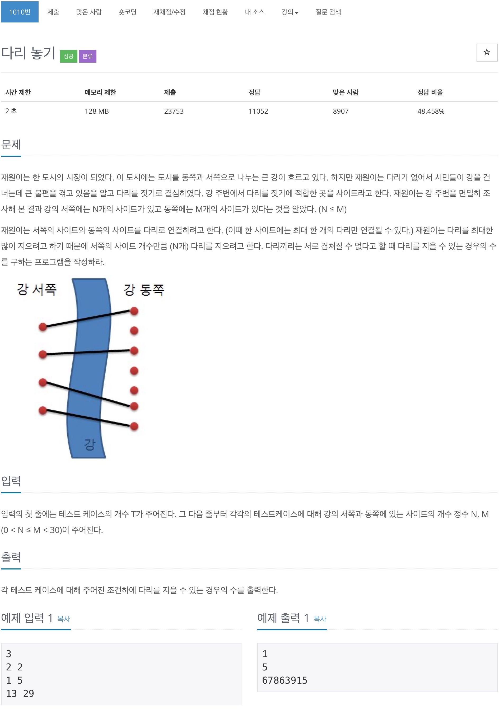

# 백준 1010 - 다리 놓기



## 전체 소스 코드
```cpp
#include <iostream>
using namespace std;

int T, N, M;
int arr[33][33];

int main(void) {
    cin >> T;

    while (T--) {
        cin >> N >> M;

        for (int i = 1; i <= M; i++) {
            arr[1][i] = i;
            arr[i][i] = 1;
        }

        for (int i = 2; i <= N; i++) {
            for (int j = i; j <= M; j++) {
                if (i != j) {
                    for (int k = 1; k < j; k++) {
                        arr[i][j] += arr[i - 1][k];
                    }
                }
            }
        }

        // for (int i = 1; i <= M; i++) {
        //     for (int j = 1; j <= M; j++) {
        //         cout << arr[i][j] << " ";
        //     }
        //     cout << endl;
        // }

        cout << arr[N][M] << '\n';

        for (int i = 1; i <= N; i++) {
            for (int j = 1; j <= M; j++) {
                arr[i][j] = 0;
            }
        }
    }
}
```