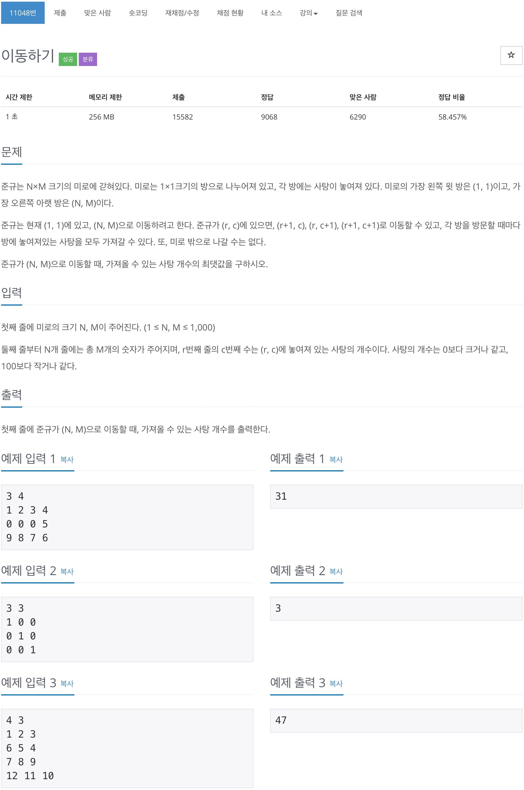

# 백준 11048 - 이동하기



## 전체 소스 코드
```cpp
#include <iostream>
using namespace std;

int N, M;
int arr[1010][1010];
int dp[1010][1010];

int main(void) {
    cin >> N >> M;

    for (int i = 0; i < N; i++) {
        for (int j = 0; j < M; j++) {
            cin >> arr[i][j];
        }
    }
    dp[0][0] = arr[0][0];
    for (int i = 0; i < N; i++) {
        for (int j = 0; j < M; j++) {
            int y = i;
            int x = j;
            int ny = y + 1;
            int nx = x + 1;

            if (0 <= ny && ny < N) {
                dp[ny][x] = max(dp[ny][x], dp[y][x] + arr[ny][x]);
            }

            if (0 <= nx && nx < M) {
                dp[y][nx] = max(dp[y][nx], dp[y][x] + arr[y][nx]);
            }

            if (0 <= ny && ny < N && 0 <= nx && nx < M) {
                dp[ny][nx] = max(dp[ny][nx], dp[y][x] + arr[ny][nx]);
            }
        }
    }

    cout << dp[N - 1][M - 1] << '\n';

    return 0;
}
```