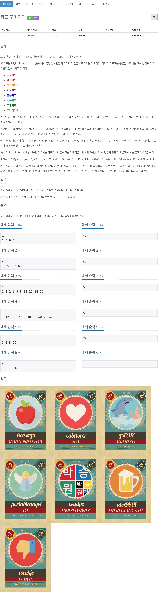

# 백준 11052 - 카드 구매하기



## 전체 소스 코드
```cpp
#include <iostream>
using namespace std;

int N;
int arr[10001];
int money[10001];

int main(void) {
    cin >> N;

    for (int i = 1; i <= N; i++) {
        cin >> arr[i];
    }

    money[1] = arr[1];
    for (int i = 2; i <= N; i++) {
        for (int j = 1; j <= N && j <= i; j++) {
            money[i] = max(money[i], money[i - j] + arr[j]);
        }
    }

    cout << money[N] << '\n';

    return 0;
}
```