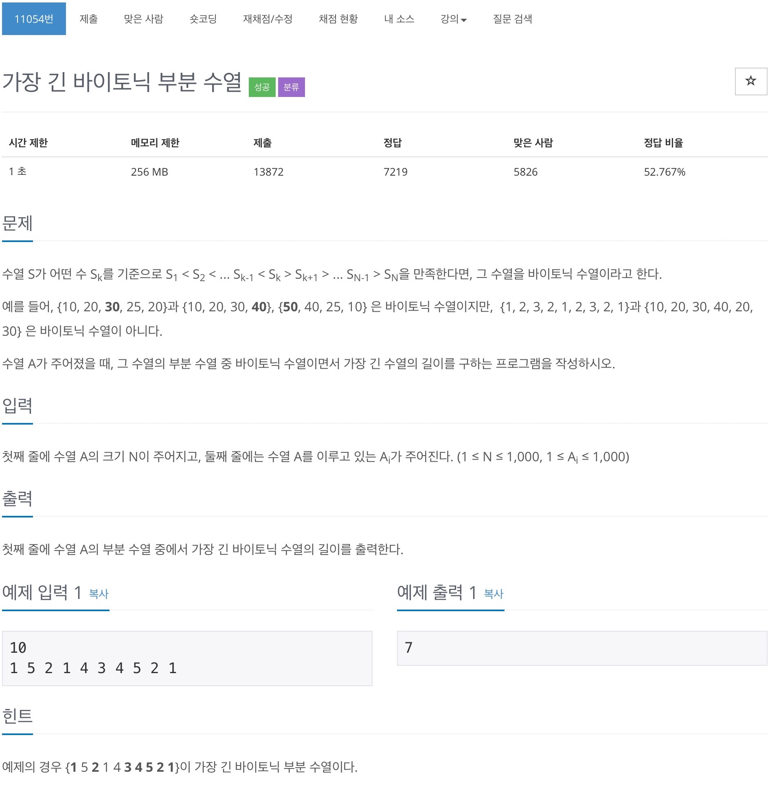

# 백준 11054 - 가장 긴 바이토닉 부분 수열



## 전체 소스 코드
```cpp
#include <iostream>
#include <vector>
using namespace std;

int N;

int main(void) {
    cin >> N;
    vector<int> v(N);
    vector<int> increase(N);
    vector<int> decrease(N);
    vector<int> totalLength(N);

    for (int i = 0; i < N; i++) {
        cin >> v[i];
    }

    for (int i = 0; i < N; i++) {
        int cntValue = v[i];
        int maxValue = 0;

        for (int j = 0; j < i; j++) {
            if (v[j] < cntValue && maxValue < increase[j]) {
                maxValue = increase[j];
            }
        }
        increase[i] = maxValue + 1;
    }

    for (int i = N - 1; i >= 0; i--) {
        int cntValue = v[i];
        int maxValue = 0;

        for (int j = N - 1; j > i; j--) {
            if (v[j] < cntValue && maxValue < decrease[j]) {
                maxValue = decrease[j];
            }
        }

        decrease[i] = maxValue + 1;
    }

    int maxLength = 0;
    for (int i = 0; i < N; i++) {
        totalLength[i] = increase[i] + decrease[i] - 1;

        maxLength = max(maxLength, totalLength[i]);
    }

    cout << maxLength << '\n';
    return 0;
}
```