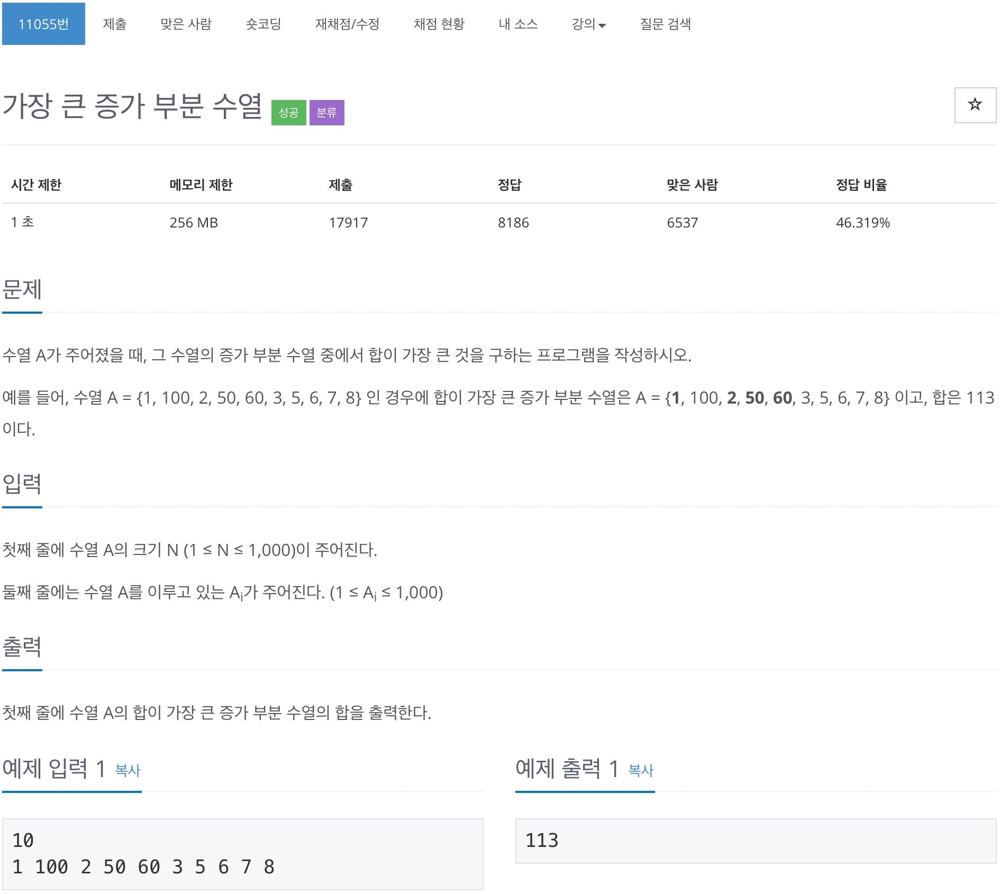

# 백준 11055 - 가장 큰 증가하는 부분 수열



## 전체 소스 코드
```cpp
#include <iostream>
#include <vector>
using namespace std;

int N;

int main(void) {
    cin >> N;
    vector<int> v(N);
    vector<int> sum(N);

    for (int i = 0; i < N; i++) {
        cin >> v[i];
    }

    for (int i = 0; i < N; i++) {
        int cntLimit = v[i];
        int maxSum = 0;

        for (int j = 0; j < i; j++) {
            if (v[j] < cntLimit && maxSum < sum[j]) {
                maxSum = sum[j];
            }
        }

        sum[i] = maxSum + v[i];
    }

    int result = 0;
    for (int i = 0; i < N; i++) {
        result = max(result, sum[i]);
    }

    cout << result << '\n';
    return 0;
}
```