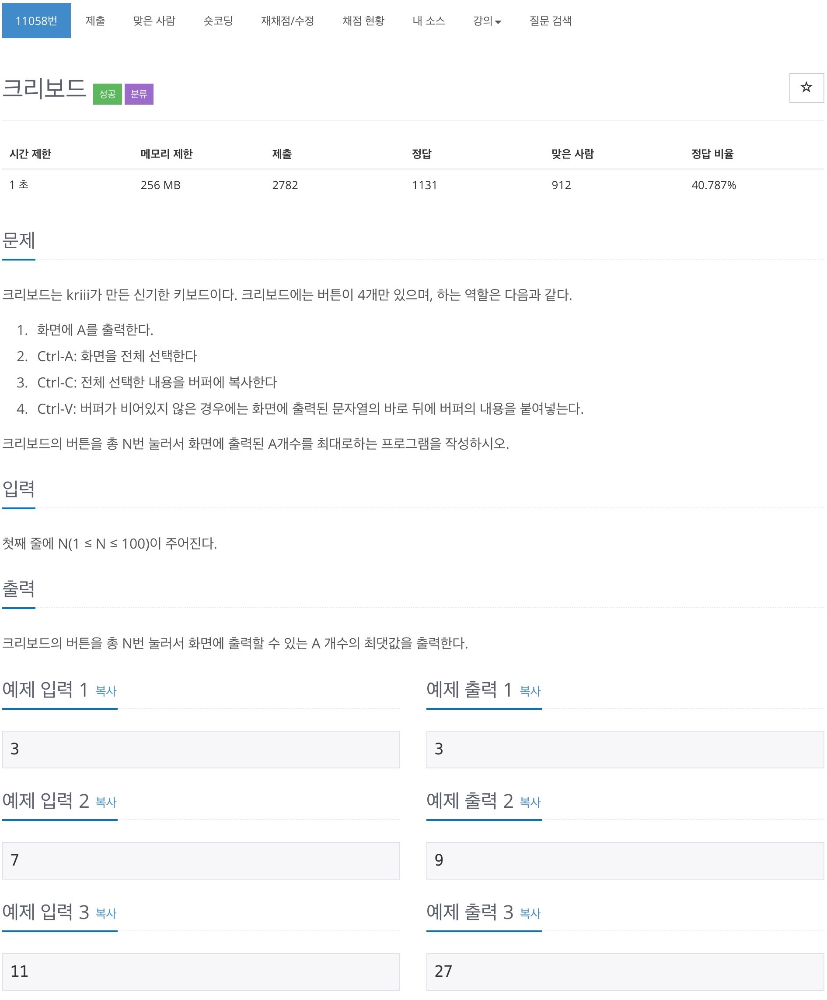
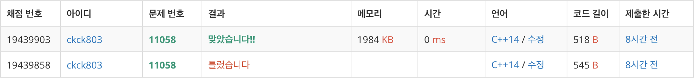

# 백준 11058 - 크리보드



## 채점 현황



## 전체 소스 코드
```cpp
#include <bits/stdc++.h>
using namespace std;

int n;
long long dp[110];

int main(void) {
    cin >> n;
    for (int i = 0; i < 101; i++) {
        dp[i] = i;
    }
    for (int i = 1; i < 101; i++) {
        long long buffer = dp[i];

        long long num = 1;
        for (int j = i; j < 101; j++) {
            long long temp = dp[i] + buffer * num;

            if (dp[j + 3] < temp) {
                dp[j + 3] = temp;
            }
            num++;
        }
    }

    cout << dp[n] << '\n';
    return 0;
}
```