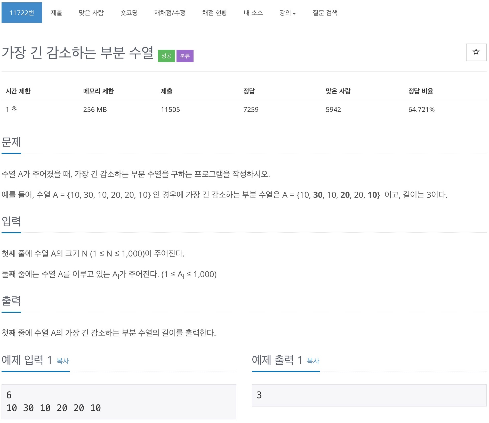

# 백준 11722 - 가장 긴 감소하는 부분 수열



## 전체 소스 코드
```cpp
#include <iostream>
#include <vector>
using namespace std;

int N;

int main(void) {
    cin >> N;
    vector<int> v(N);
    vector<int> decrease(N);

    for (int i = 0; i < N; i++) {
        cin >> v[i];
    }

    for (int i = N - 1; i >= 0; i--) {
        int cntLimit = v[i];
        int maxNum = 0;

        for (int j = N - 1; j > i; j--) {
            if (v[j] < cntLimit && maxNum < decrease[j]) {
                maxNum = decrease[j];
            }
        }
        decrease[i] = maxNum + 1;
    }

    int maxValue = 0;
    for (int i = 0; i < N; i++) {
        maxValue = max(maxValue, decrease[i]);
    }
    cout << maxValue << '\n';
    return 0;
}
```