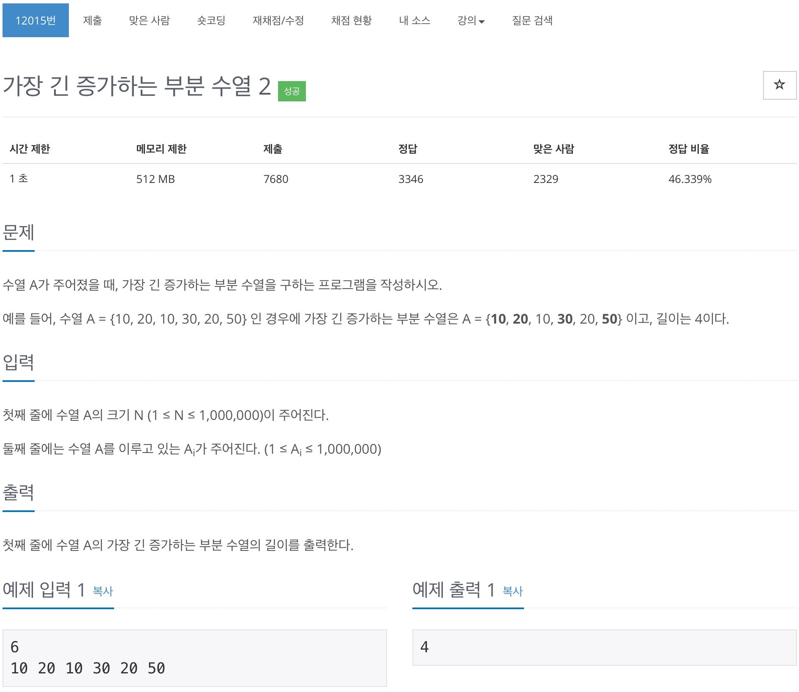

# 백준 12015 - 가장 긴 증가하는 부분 수열 2



## 전체 소스 코드
```cpp
#include <algorithm>
#include <iostream>
#include <vector>
using namespace std;

#define MAX 1000001

int N;

int main(void) {
    cin >> N;
    int arr[MAX];
    int cache[MAX];

    for (int i = 1; i <= N; i++) {
        cin >> arr[i];
    }

    cache[1] = arr[1];
    int length = 1;
    for (int i = 2; i <= N; i++) {
        int cntValue = arr[i];

        if (cache[length] < cntValue) {
            length += 1;
            cache[length] = cntValue;
        } else {
            int index = lower_bound(cache + 1, cache + length + 1, cntValue) - cache;
            cache[index] = cntValue;
        }
    }

    cout << length << '\n';
    return 0;
}
```