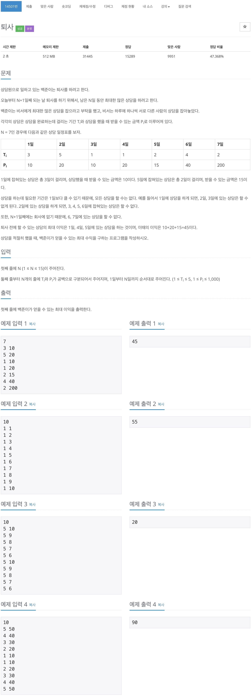
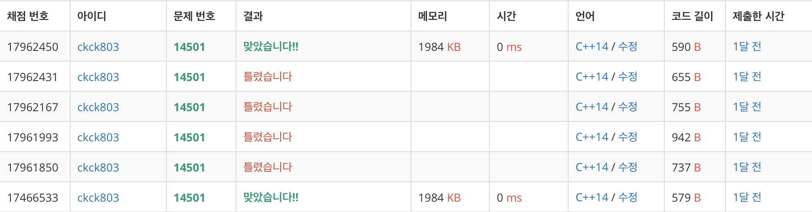

# 백준 14501 - 퇴사


## 채점 현황



## 전체 소스 코드
```cpp
#include <iostream>
using namespace std;

int N;
pair<int, int> consult[30];
int pay[30];

int main(void) {
    cin >> N;

    for (int i = 1; i <= N; i++) {
        int time, price;
        cin >> time >> price;

        consult[i] = {time, price};
    }

    for (int i = 1; i <= N; i++) {
        int time = consult[i].first;
        int price = consult[i].second;
        int nextTime = i + time;

        if (pay[nextTime] < pay[i] + price) {
            pay[nextTime] = pay[i] + price;
        }
        pay[i + 1] = max(pay[i], pay[i + 1]);
    }

    cout << pay[N + 1] << endl;
}
```